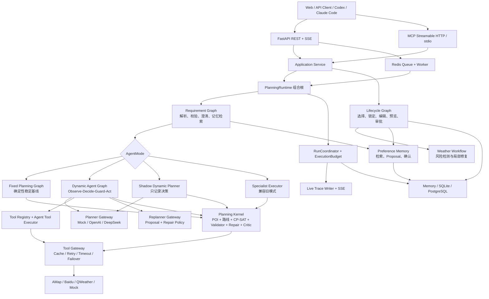
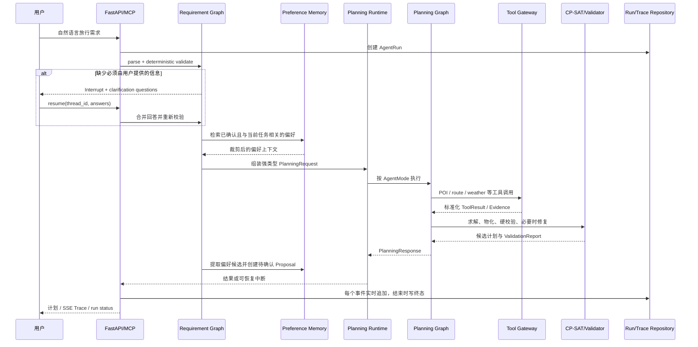
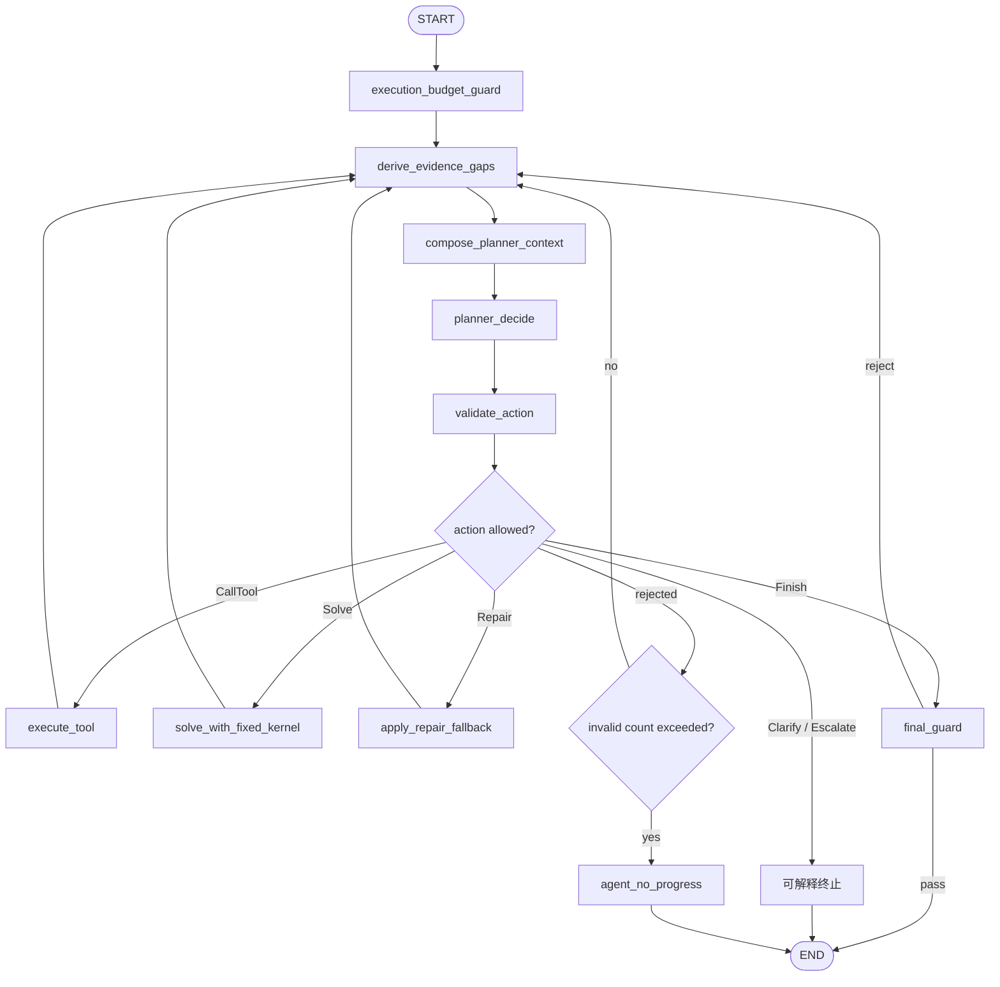
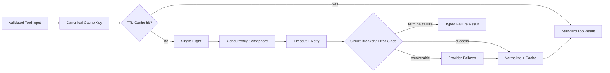
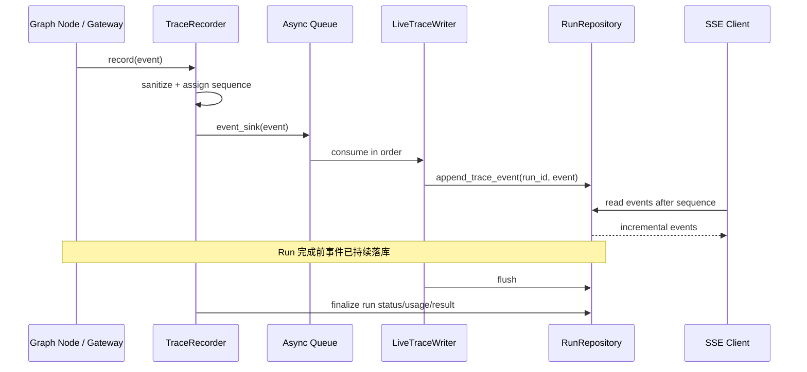

# TravelPilot 当前项目架构、实现细节与面试指南

> 文档基线：2026-09-22 当前工作树  
> 适用阶段：v1.3 生产规划能力已迁移到动态 Agent 链路，固定工作流作为显式基线保留  
> 阅读目标：理解系统如何启动、一次请求如何流动、Agent 如何决策、工具和求解器如何协作、失败如何恢复，以及面试时怎样准确介绍项目

---

## 1. 先给出项目的准确结论

TravelPilot 不是一个“让大模型直接生成旅游攻略”的聊天应用，而是一个将自然语言理解、动态决策、外部工具、确定性约束求解、结果校验、人机协作、记忆和可观测性组合起来的旅行规划 Agent 系统。

当前项目同时保留两条规划路径，但职责已经不同：

- `dynamic_planner`：生产默认链路。Planner 根据当前目标、Evidence 缺口、Observation、候选方案和剩余预算，逐轮选择 `Clarify / CallTool / Solve / Repair / Finish / Escalate` 强类型 Action，再由确定性 Guard 决定是否允许执行；Grounded Critic 与 Soft Repair 也在该 Graph 中显式运行。
- `fixed_workflow`：历史确定性 LangGraph 基线。它不再被动态生产链路内部调用，只用于显式回归、Shadow 主结果和既有 Release/Ablation 对照。

目前最重要的事实是：`dynamic_planner` 已完成生产规划功能迁移。`SolveAction` 直接调用无 Graph 依赖的 `PlanningKernelService`；LLM Replanner Patch 通过 Policy 后会真实应用，并继续执行 Route Delta、重新物化与 Hard Revalidate；`QualityReviewService` 承担 Grounded Critic、Soft Repair、二次评审、质量比较和 baseline 恢复。Lifecycle 创建计划也通过统一 Runner 消费动态 `kernel_snapshot`，不再回落到 `fixed_workflow`。

项目当前还完整实现了：

- 自然语言需求解析与 LangGraph `Interrupt/Resume` 澄清；
- 缺省住宿时的确定性住宿锚点推荐及每日往返路线；
- OR-Tools CP-SAT 景点跨日分配与确定性时间排程；
- Hard Validator、确定性硬修复、LLM Critic 与软修复；
- 计划版本、锁定、局部变更预览、审批和天气触发修复；
- 用户偏好检索、当前需求覆盖历史记忆、规划后偏好候选提取与确认后持久化；
- Tool Gateway 的缓存、Single Flight、超时、重试、并发限制、熔断和 Provider Failover；
- 每次执行独立 `AgentRun`、事件级实时 Trace 持久化与 SSE 增量消费；
- FastAPI、MCP Streamable HTTP、MCP stdio、PostgreSQL、Redis 队列和 Worker 接入。

### 1.1 当前成熟度标签

| 能力 | 当前状态 | 面试时的准确说法 |
|---|---|---|
| 固定规划工作流 | 已完整实现 | 可作为稳定基线运行 |
| 动态 Planner 决策循环 | 已完成生产功能迁移 | Planner 动态选 Action，工具、求解、硬/软修复和质量闭环均已接通 |
| Planner 强类型 Action 与 Guard | 已实现 | Action 在执行前经过确定性策略校验 |
| 动态 Tool 执行 | 已接入 | POI、路线、天气、偏好与住宿锚点均有内建 Handler |
| OR-Tools + Validator | 已完整实现 | 求解负责候选，Validator 才负责交付安全性 |
| LLM Replanner Patch | 硬修复闭环已实现 | Proposal 过 Policy 后应用 Patch、增量补路并硬复验 |
| Grounded Critic / Soft Repair | 动态闭环已实现 | Grounding、质量门、软 Patch、硬复验和收益比较均在新链路可见 |
| HITL | 已完整实现于 Requirement/Lifecycle Graph | 支持澄清、选择、锁定、变更预览与审批 |
| 长期偏好 Memory | 已实现受控闭环 | 只检索已确认偏好，规划后生成待确认 Proposal |
| 实时 Trace | 已实现 | 节点执行期间逐事件写库，可经 SSE 拉取 |
| MCP | 已实现 | 支持 HTTP 与 stdio，暴露业务工具和资源 |
| v1.3 动态轨迹 Benchmark | 尚未完成 | 现有 30 条消融指标来自 v1.0 固定工作流 Mock 评测 |

### 1.2 版本标识

[pyproject.toml](../pyproject.toml)、[src/travel_agent/__init__.py](../src/travel_agent/__init__.py) 和 README 已同步为 `1.3.0`。该版本已经覆盖完整的动态生产规划闭环，但仍不代表所有可靠性和评测目标结束：当前动态 Checkpoint 为进程内实现，Evidence 跨进程持久化和真实模型 Benchmark 仍按本文边界说明。

---

## 2. 面试时怎样用 30 秒介绍项目

> TravelPilot 是我用 LangGraph 构建的旅行规划 Agent。它不是让 LLM 直接输出行程，而是把自然语言需求、工具 Evidence、OR-Tools 约束求解、确定性 Validator 和局部修复串成有界决策循环。Planner 只能生成强类型 Action，Action 必须经过策略 Guard 才能调用受限 Tool Registry 或进入求解；所有工具结果会标准化为 Evidence 和 Observation 回写状态，影响下一轮决策。系统还支持 Interrupt/Resume、计划版本与审批、确认式偏好记忆，以及运行中逐事件持久化的 Trace。外部地图和天气调用统一经过带缓存、Single Flight、重试、熔断及 Failover 的 Gateway。

这段介绍的重点不是技术名词数量，而是四层职责：

1. LLM 做语义理解与软决策；
2. LangGraph 管理状态、节点、路由和循环；
3. OR-Tools 与确定性代码执行硬约束；
4. Trace、Budget、Repository 让行为可控制、可恢复、可复现。

---

## 3. 系统总架构



这张图可以分成六个层次理解：

| 层次 | 责任 | 关键模块 |
|---|---|---|
| 接入层 | REST、SSE、MCP 协议和身份边界 | `api/`、`mcp_server/` |
| 应用层 | 用例编排、DTO 转换、错误映射 | `application/` |
| Agent/Graph 层 | State、Node、Edge、Action、Interrupt、循环 | `requirements/`、`graph/`、`lifecycle/` |
| 规划领域层 | 求解、校验、修复、路线与住宿策略 | `planning/`、`domain/` |
| 能力网关层 | LLM 与外部数据访问的可靠性、安全和标准化 | `agents/*/gateway.py`、`tools/`、`weather/` |
| 基础设施层 | Run、Trace、Checkpoint、数据库、队列 | `execution/`、`infrastructure/` |

### 3.1 为什么不是一个大 Graph

项目把不同生命周期拆成三个主要 Graph：

- `Requirement Graph` 处理“用户到底想要什么”，并负责缺字段澄清和偏好上下文。
- `Planning Graph` 处理“如何得到可交付计划”，包括固定工作流和 v1.3 动态循环。
- `Lifecycle Graph` 处理“计划生成以后怎样被选择、锁定、修改、审批和响应天气变化”。

拆分依据是职责、状态寿命和中断点不同，而不是为了贴“多 Agent”标签。需求澄清可能跨多轮请求；一次规划运行有独立预算和 Trace；计划生命周期则可能持续数天并经历多个版本。

---

## 4. 启动与依赖组装：PlanningRuntime 是组合根

入口可以从 [app.py](../src/travel_agent/app.py) 和 [runtime.py](../src/travel_agent/runtime.py) 阅读。

`PlanningRuntime.create(settings)` 的工作不是执行业务，而是根据配置显式组装全部依赖：

1. 校验 Settings，缺少真实 Provider 的 Key 或 Model 时启动失败；
2. 创建 HTTP Client；
3. 选择 POI、路线、天气、Requirement、Planner、Replanner、Critic、Edit Provider；
4. 组装 Tool Gateway、Weather Gateway 和各 LLM Gateway；
5. 打开 Checkpointer、Plan Repository、Run Repository、Preference Repository；
6. 构建固定 Planning Graph、Requirement Graph、Lifecycle Graph；
7. 在需要时构建 Dynamic Agent Graph；
8. 创建 `RunCoordinator` 与应用服务；
9. 在应用关闭时统一释放 HTTP Client、数据库和 Checkpointer。

这样做有三个好处：

- 业务节点不直接读取环境变量，也不在内部偷偷创建客户端；
- Mock、真实 Provider、内存、SQLite、PostgreSQL 可以在组合层替换；
- 测试可以注入故障 Provider、Budget 和 Repository，而不修改 Graph 代码。

### 4.1 当前主要配置维度

| 配置类别 | 典型值 | 作用 |
|---|---|---|
| `AGENT_MODE` | `fixed_workflow` / `dynamic_planner` / `shadow_dynamic_planner` | 选择规划控制面 |
| `PLANNER_PROVIDER` | `mock` / `openai` / `deepseek` | 动态 Planner 模型来源 |
| `REPLANNER_PROVIDER` | `disabled` / `deterministic` / `mock` / `openai` / `deepseek` | 修复提案来源 |
| 地图 Provider | `mock` / `amap` / `baidu` | POI 与路线数据 |
| 天气 Provider | `mock` / `amap` / `qweather` | 天气快照 |
| Repository Backend | `memory` / `sqlite` / `postgres` | Run、Plan、Preference 持久化 |
| Queue Backend | 内存或 Redis | 异步 Run 派发 |

代码级 `Settings()`、`.env.example` 与 Docker 部署示例都默认选择 `dynamic_planner`。`fixed_workflow` 必须显式配置，主要用于历史回归和消融；真实环境仍应核对最终注入的 `AGENT_MODE`，避免部署层覆盖造成控制面偏差。

---

## 5. 核心对象与 ID：不要把它们混在一起

| 对象 | 含义 | 生命周期 |
|---|---|---|
| `TripSpec` | 已规范化的旅行约束与偏好 | 一次需求版本 |
| `thread_id` | LangGraph 会话与恢复标识 | 可跨 Interrupt/Resume |
| `run_id` | 一次具体执行的观测与预算边界 | 每次执行独立 |
| `AgentRunRecord` | Run 状态、终止原因、使用量、Trace 摘要 | 可持久化和回放 |
| `session_id` | 计划生命周期会话 | 可包含多个计划版本 |
| `PlanVersion` | 已接受计划的不可变版本快照 | 每次批准变更递增 |
| `Preview` | 尚未批准的局部修改候选 | 接受或拒绝后结束 |
| `candidate_id` | 一次求解产生的候选计划标识 | 一次规划运行内 |
| `evidence_id` | 标准化事实记录标识 | 当前动态 Run 内 |
| `action_id` | Planner Action 实例标识 | 单轮决策 |
| `action_fingerprint` | 忽略随机 ID 后的动作语义指纹 | 用于防重复和停滞检测 |
| `observation_id` | Action 执行结果摘要标识 | 当前动态 Run 内 |

关键区分：

- `thread_id` 解决“从哪个 Graph 状态恢复”；
- `run_id` 解决“这一次实际执行花了多少资源、发生了什么”；
- `session_id` 解决“用户最终维护的是哪份旅行计划”；
- `version` 解决“并发修改和历史回溯”。

---

## 6. 一次自然语言请求的完整链路



### 6.1 为什么先 Requirement 再 Planning

因为“缺少输入”和“规划不可行”是不同问题。

- 未提供目的地或日期，是需求不完整，应当澄清；
- 已知所有输入但预算或时间窗冲突，才可能是业务不可行；
- 地图超时是外部工具失败，既不是需求不完整，也不是业务不可行。

把这三种状态拆开，是 Agent 能可靠恢复和正确解释失败的基础。

---

## 7. Requirement Graph：自然语言、澄清、记忆和偏好提取

主实现位于 [requirements/workflow.py](../src/travel_agent/requirements/workflow.py)。

### 7.1 主流程

Requirement Graph 的逻辑可以概括为：

```text
parse natural language
    -> deterministic validate
    -> [missing/conflict?]
       -> build clarification questions
       -> interrupt
       -> merge resume patch
       -> validate again
    -> resolve anchors
    -> compose confirmed preference context
    -> assemble TripSpec
    -> execute selected planning mode
    -> prepare preference evidence
    -> extract preference candidates
    -> validate candidates
    -> create pending proposals
    -> finalize response
```

### 7.2 LLM 和确定性代码怎样分工

Requirement Model 负责把自然语言解析为结构化 Draft，例如目的地、日期、预算、兴趣、节奏和交通偏好。它不负责决定 Draft 是否逻辑正确。

确定性 Validation 负责：

- 检查日期先后与旅行天数；
- 检查必要字段；
- 识别相互冲突的输入；
- 判断哪些字段可以默认，哪些必须询问用户；
- 将澄清回答作为 Patch 合并并再次校验。

因此，即使模型输出满足 JSON Schema，也不代表业务上可用。Schema 解决“形状正确”，Validation 解决“语义和约束正确”。

### 7.3 Interrupt/Resume 的意义

Graph 在必须获取用户信息时调用 LangGraph `interrupt`，并由 Checkpointer 保存状态。恢复请求携带同一个 `thread_id` 和结构化回答，Graph 从中断点继续，而不是从头重新解析整段历史。

这使得澄清具备：

- 可恢复状态；
- 明确的待回答字段；
- 多轮回答合并；
- 重启后的持久化恢复；
- 对重复 Resume 的幂等和并发保护。

### 7.4 当前偏好 Memory 怎样进入规划

规划前，`PreferenceContextComposer` 只读取：

- 状态为已确认的偏好；
- Scope 与当前任务匹配的偏好；
- 对当前 Agent Role 有意义的偏好；
- 未被用户当前显式输入覆盖的偏好。

候选偏好会按相关性、新鲜度、置信度和角色相关性评分，并受字符或 Token Budget 限制。注入 Planner 的是精简 Manifest，而不是完整数据库记录。

优先级是：

```text
当前请求中的显式约束 > 当前任务上下文 > 已确认长期偏好 > 系统默认值
```

例如历史偏好是“喜欢慢节奏”，但本次用户明确说“这次想特种兵打卡”，本次显式需求必须获胜。

### 7.5 规划后偏好提取是否已实现

已实现，但不是“规划一结束就把模型猜测永久写入 Memory”。正确闭环是：

1. 从本次用户输入和已验证 Requirement Draft 构造偏好 Evidence；
2. 确定性提取兴趣、避开项、节奏、步行耐受、交通、作息、预算风格和无障碍需求等候选；
3. 判断持久化意图是长期、仅本次还是不明确；
4. 校验、去重并创建 `pending proposal`；
5. 用户确认后才转为可检索的长期 Preference。

当前实现刻意不从最终行程文本反推用户偏好，因为计划里出现“博物馆”可能是系统安排，不等于用户长期喜欢博物馆。

相关代码：

- [memory/extraction.py](../src/travel_agent/memory/extraction.py)
- [memory/policy.py](../src/travel_agent/memory/policy.py)
- [memory/context.py](../src/travel_agent/memory/context.py)
- [memory/service.py](../src/travel_agent/memory/service.py)

---

## 8. 三种规划模式与旧配置别名必须说清楚

| 模式 | 下一步动作由谁决定 | 是否执行动态工具动作 | 最终求解路径 | 用途 |
|---|---|---:|---|---|
| `fixed_workflow` | Graph 固定边和条件路由 | 否 | 完整固定规划内核 | 历史基线与显式消融 |
| `dynamic_planner` | Planner Model | 是 | `PlanningKernelService` + `QualityReviewService` | 生产默认路径 |
| `shadow_dynamic_planner` | Planner Model 只做一次影子决策 | 否 | 固定规划内核 | 无副作用观察模型行为 |
| 旧 `specialist_subagents` / `shadow_subagents` | 仅作配置别名 | 映射后决定 | 分别映射到 dynamic / shadow dynamic | 兼容旧配置 |

正常 Runtime 已不再装配或执行旧 `SpecialistExecutor`。遇到 `specialist_subagents` 配置时，`effective_agent_mode` 会将它迁移为 `dynamic_planner`；`shadow_subagents` 同理映射为 `shadow_dynamic_planner`。旧实现代码仅为兼容测试和历史阅读保留，不能再描述为生产流程中的一层。

---

## 9. v1.3 Dynamic Agent Graph：真正的 Observe → Decide → Act

主实现位于：

- [graph/agentic_state.py](../src/travel_agent/graph/agentic_state.py)
- [graph/agentic_workflow.py](../src/travel_agent/graph/agentic_workflow.py)
- [agents/actions.py](../src/travel_agent/agents/actions.py)
- [agents/action_policy.py](../src/travel_agent/agents/action_policy.py)
- [agents/context.py](../src/travel_agent/agents/context.py)

### 9.1 Graph 主循环



这条循环体现了真正的反馈：Tool 执行后产生 Observation 和 Evidence，重新派生 Evidence Gap，下一轮 Planner 看到的上下文已经发生变化。

### 9.2 State 中保存什么

`AgenticTravelState` 不保存 Provider 原始大响应，而保存最小化、强类型状态，主要包括：

- 当前 `TripSpec` 与 Agent Phase；
- Evidence Record 与 Evidence Gap；
- 最近有限条 Observation；
- Planner Context 与最近一次 Decision/Action；
- Action History 与重复动作指纹；
- 候选计划、选中计划和 Validation 信息；
- 固定内核返回的 PlanningResponse；
- 已询问的澄清字段；
- 决策轮次、错误与终止信息。

大响应不进 State 的原因是：减少 Checkpoint 体积、控制 Prompt、避免 Provider 字段污染领域模型，也降低泄露密钥或无关元数据的风险。

### 9.3 Planner 看到什么

`DynamicPlannerContext` 是显式白名单上下文：

- `goal`：当前规范化旅行目标；
- `phase`：当前阶段；
- `evidence_gaps`：还缺什么事实；
- `evidence_catalog`：可引用 Evidence 的摘要；
- `recent_observations`：最近动作结果；
- `candidate_summaries`：候选方案硬校验状态、天数和成本摘要；
- `violation_summaries`：未解决违规的指纹和严重级别；
- `tool_manifest`：当前角色和阶段允许使用的工具；
- `budget_remaining`：剩余模型、工具、轮次和时间预算；
- `context_manifest`：本轮上下文包含哪些 Evidence 和工具、估算大小。

上下文超过限制时，系统先删除最旧 Observation，再删除较旧 Evidence 摘要。如果最小基础上下文仍超限，则明确失败，而不是静默截断关键目标。

### 9.4 六种强类型 Action

| Action | 含义 | 核心前置条件 |
|---|---|---|
| `ClarifyAction` | 请求用户补充不可推断的信息 | 字段确实需要用户输入，且不能重复询问 |
| `CallToolAction` | 调用 Registry 中的领域工具 | 工具对 Planner 和当前 Phase 可见，参数通过 Schema |
| `SolveAction` | 进入求解和候选生成 | 必需 Evidence Gap 已满足 |
| `RepairAction` | 针对具体候选和违规请求修复 | Candidate、Violation 引用存在且仍未解决 |
| `FinishAction` | 交付指定候选 | 候选存在且已通过硬校验，必需 Evidence 完整 |
| `EscalateAction` | 无法安全自治时终止并说明 | 给出结构化原因 |

所有 Action 使用 Pydantic 严格模型和判别联合，额外字段被禁止。这样可以让模型“选择受限动作”，而不是生成任意命令。

### 9.5 Action Guard 为什么是核心

模型输出经过 Schema 后，还必须经过 [action_policy.py](../src/travel_agent/agents/action_policy.py) 的确定性 Guard。它检查：

- Action 是否允许出现在当前 Phase；
- 引用的 Evidence 是否存在；
- Tool 是否注册、是否允许当前 Agent Role 和 Phase 使用；
- 参数是否通过该工具的 Input Schema；
- 是否试图指定被禁止的 Provider、URL、身份或 Secret 字段；
- `Solve` 前是否仍有必需 Evidence Gap；
- `Repair` 引用的 Candidate/Violation 是否有效；
- `Finish` 是否指向已硬校验候选；
- Action 语义指纹是否重复超过阈值。

因此安全边界不是“相信模型遵守 Prompt”，而是：

```text
Model Proposal -> Pydantic Schema -> Action Policy -> Side Effect
```

### 9.6 Evidence、Observation 与 ToolResult 的区别

- `ToolResult`：Gateway 返回的标准化调用结果，包含成功、错误分类、缓存和 Provider 元数据。
- `EvidenceRecord`：从工具结果中提炼、可去重、可引用的领域事实。
- `AgentObservation`：告诉 Planner “上一步发生了什么”的短摘要。
- `EvidenceGap`：由当前目标、已有 Evidence 和候选状态确定性派生的缺口。

一个典型循环是：

```text
Gap: 缺少目的地 POI
-> Planner: CallTool(poi.search)
-> ToolResult: 标准化 POI 列表
-> EvidenceRecord: poi_facts，带 content hash
-> Observation: tool_succeeded + evidence_ids
-> derive_evidence_gaps
-> Gap: POI 已满足，路线仍缺失
-> Planner 下一轮改为 CallTool(route.build_matrix)
```

Evidence Repository 当前是 Run 隔离的内存实现，使用内容 Hash 去重并限制最大记录数。它证明了 Evidence 模型与策略，但还没有作为独立持久化表跨进程恢复。

### 9.7 Finish 不是模型说结束就结束

`FinishAction` 还会经过 Final Guard：

1. Candidate 必须存在；
2. Candidate 必须有 `validation.valid = true`；
3. 所有 Required Evidence Gap 必须满足；
4. 必须存在完整 Planning Snapshot。
5. Grounded Critic/确定性质量门必须完成，或者已记录安全降级结果。

如果不满足，Finish 被拒绝，事件写入 Trace，并回到下一轮决策；连续无进展或超预算时以明确终止原因结束。

### 9.8 当前动态路径的真实限制

这部分建议面试时主动说，因为它体现工程判断。

1. `AgentToolExecutor` 已内建 `poi.search`、`route.build_matrix`、`anchor.resolve`、`weather.snapshot` 和 `preference.retrieve` Handler；`route.load_delta` 不开放给 Planner 任意触发，而由硬/软 Repair Kernel 根据实际 Patch 差异执行。
2. 动态 `SolveAction` 已直接消费 POI/Route Evidence 并调用 `PlanningKernelService`；完整路线矩阵必须在 Tool 阶段获得，Solve 不再隐藏补查路线。
3. 动态 Route Tool 受 Registry 批量上限约束；候选规模过大时会明确返回 `route_batch_limit_exceeded`，不会返回部分矩阵冒充完整 Evidence。
4. `ClarifyAction` 和 `EscalateAction` 在动态内层当前形成可解释终止；真正跨请求的澄清仍由外层 Requirement Graph 的 Interrupt/Resume 承担。
5. Grounded Soft Critic、质量改善比较和 Soft Repair 已由 `QualityReviewService` 接入动态 Graph；当前限制是动态 Checkpoint/Evidence 仍以进程内恢复为主，尚未达到 Requirement/Lifecycle SQLite Checkpointer 的跨进程恢复等级。

现在的边界不再是功能迁移，而是持久化与真实模型评测：模型控制软决策，所有有副作用的执行继续由确定性 Service 和 Policy 约束。

---

## 10. Fixed Planning Graph：稳定的确定性规划内核

主实现位于 [graph/workflow.py](../src/travel_agent/graph/workflow.py)。虽然叫 fixed，但它并不是一条无条件流水线；它仍然是有状态、有条件边、有硬修复与软修复循环的 LangGraph，只是下一节点主要由代码规则而不是 Planner Model 决定。

### 10.1 主要节点

```text
execution_budget_guard
-> build_search_plan
-> load_pois
-> resolve_poi_facts
-> resolve_stay_anchor
-> derive_day_boundaries
-> build_route_matrix
-> build_optimization_problem
-> solve_candidate_variants
-> materialize_optimized_candidates
-> validate_candidates
-> [deliverable / hard repair / infeasible]
-> prepare_critic_context
-> critic
-> grounding check
-> deterministic quality gate
-> [soft repair / keep baseline]
-> validate and compare
-> select_best / mark_infeasible
```

完整代码中还包括硬修复目标选择、违规分析、Repair Plan 构造、Patch 应用、Route Delta 收集与加载，以及软修复后的重新物化、基线恢复和候选比较节点。

### 10.2 POI 搜索不是单次宽泛查询

`build_search_plan` 会根据目的地、必去项、兴趣和天数构造受控搜索计划，再通过 Gateway 加载和规范化候选。这样做比让模型直接列景点可靠，因为后续每个 POI 都需要稳定 ID、坐标、开放时间、预计游览时长、价格和标签等字段。

对于 Provider 缺失字段，`POIDefaultPolicy` 可以补充受控默认值，同时保留数据质量和假设标记。Validator 和最终解释能区分真实字段与默认字段。

### 10.3 住宿不是必填时怎样规划每日往返

当前实现不虚构具体酒店，也不依赖 OTA 酒店库存。

#### 用户填写住宿

显式住宿地址先解析为坐标，并作为住宿锚点。每日边界按旅行日期处理：

- 第一天：抵达点 → 当日 POI → 住宿点；
- 中间日：住宿点 → 当日 POI → 住宿点；
- 最后一天：住宿点 → 当日 POI → 离开点。

#### 用户没有填写住宿且是多日行程

系统从候选 POI 中选择一个“住宿区域锚点”，而不是推荐具体酒店：

- 必去 POI 权重为 3；
- 兴趣匹配 POI 权重为 2；
- 普通 POI 权重为 1；
- 同时以较小权重考虑抵达点和离开点可达性；
- 计算候选位置到加权需求点的总代价，选择近似加权 medoid；
- 输出“建议住在某 POI 附近区域”、选择理由和置信度；
- 标记为系统假设、`confirmed = false`，不写回用户输入。

地图 API 提供 POI 和路线能力，但通常不能等价提供可靠的酒店库存、房价和可订状态。因此当前系统只做“规划意义上的住宿区域建议”，不声称推荐可预订酒店。

#### 单日行程

单日无需构造住宿锚点，直接使用抵达和离开边界。

相关实现：[planning/stay.py](../src/travel_agent/planning/stay.py) 与 [tests/test_stay_planning.py](../tests/test_stay_planning.py)。

### 10.4 路线矩阵

路线查询不是最后展示时才调用，它是规划输入：

- 住宿/抵达边界到 POI；
- POI 之间；
- 最后 POI 到住宿/离开边界；
- 不同交通方式对应的时间、距离和步行量。

路线结果进入标准化矩阵，并被求解、物化和 Validator 使用。局部修复时只收集发生变化的边，调用 Route Delta，而不是无条件重查整个矩阵。

### 10.5 OR-Tools CP-SAT 负责什么

实现位于 [planning/optimization.py](../src/travel_agent/planning/optimization.py)。

核心变量可以抽象为：

```text
x[p, d] = 1  表示 POI p 被分配到第 d 天
```

主要硬约束包括：

- 每个必去 POI 恰好安排一次；
- 普通候选 POI 至多安排一次；
- 只在开放且可用日期安排；
- 每天至少有合理活动量；
- 每日活动数量受旅行节奏限制；
- 每日步行量不超过用户耐受；
- 已知价格时总预算不能超限；
- 日期、时间窗和计划边界合法。

目标函数综合：

- 用户兴趣和必去项收益；
- 类别多样性；
- 路线与步行成本；
- 门票和已知成本；
- 不同候选风格的偏好权重。

系统可生成 `relaxed`、`balanced`、`exploration` 等候选变体。为了可复现性，测试和默认求解使用固定随机种子与单 Worker，并对求解时间和搜索规模设置预算。

### 10.6 为什么求解后还必须 Materialize 和 Validate

CP-SAT 阶段主要解决“哪些 POI 分配到哪一天”，路线成本使用住宿/边界到 POI 的近似代理。每天内部的访问顺序再通过确定性近邻策略生成，并物化为具体开始、结束和交通段。

所以求解结果不是最终计划。真实完整链路是：

```text
Assignment Solution
-> Day Ordering
-> Schedule Materialization
-> Full Route and Time Calculation
-> Hard Validator
```

这种两阶段方法降低模型复杂度，但意味着全路线硬约束必须由 Validator 兜底。面试官问“CP-SAT 是否精确建模全部路径”时，应明确回答：当前没有把完整 TSP with Time Windows 全部塞入一个模型，而是用分配优化 + 启发式排序 + 完整校验，在计算成本和工程可控性之间取平衡。

---

## 11. Validator、Critic 与 Replanner 的职责边界

### 11.1 Hard Validator

[planning/validator.py](../src/travel_agent/planning/validator.py) 检查可确定计算的硬规则，包括：

- 计划是否为空；
- 必去项是否遗漏；
- 活动是否重叠；
- 每日时间窗是否合法；
- 首日是否早于抵达后缓冲时间；
- 末日是否晚于离开前缓冲时间；
- POI 营业时间是否满足；
- 每日活动和步行量是否超限；
- 最后一个 POI 到住宿或离开点的路线是否存在；
- 是否能按时返回住宿或到达离开点；
- 已知成本是否超预算；
- 成本未知、字段默认和住宿推荐等假设是否需要警告。

Validator 的输出是结构化 `ValidationReport` 与 Violation，而不是一句自然语言评价。

### 11.2 Critic

Critic 负责硬约束之外的软质量：节奏是否自然、安排是否连贯、是否符合用户兴趣、解释是否充分。它可以使用 Mock、OpenAI 或 DeepSeek Provider。

Critic 不能推翻 Hard Validator。其输出还要经过：

- Evidence Grounding：评论引用是否能被当前事实支持；
- 确定性 Quality Gate：建议是否值得进入软修复；
- Soft Repair Policy：修改是否越权、是否破坏硬约束；
- 修复后重新 Validate；
- 与未修复基线比较，只有更好且仍安全才采用，否则恢复基线。

### 11.3 Replanner

v1.3 Replanner 的目标是把模型限制为产生结构化 `RepairProposal/PlanPatch`。Policy 会拒绝：

- 删除必去项；
- 修改已锁定 POI；
- 引用未知 Candidate、POI 或 Violation；
- 使用越界日期；
- 重复提交相同 Proposal。

当前 LLM Proposal 通过 Policy 后会进入 `PlanningKernelService.apply_repair()`：应用 Patch、校验未受影响日期、增量加载路线、重新物化、Hard Revalidate，并比较修复前后 Violation Fingerprint。`REPLANNER_PROVIDER=deterministic` 仍可作为兼容 Proposal Provider，但不会绕过同一 Policy 与复验链路。

### 11.4 一句最关键的面试回答

> LLM 负责理解“用户更在意什么”和提出“怎么改”的候选；OR-Tools 负责组合搜索；Policy 和 Validator 负责决定“能不能执行、能不能交付”。

---

## 12. Tool Registry、Tool Executor、Gateway、Provider 和 MCP 的区别

这几个词很容易混淆。

| 组件 | 面向谁 | 职责 |
|---|---|---|
| Tool Registry | Planner/Agent | 声明可见工具、角色、阶段、输入输出 Schema 与权限 |
| Agent Tool Executor | Dynamic Graph | 根据已通过 Guard 的 Action 分发领域工具，并转成 Evidence/Observation |
| Tool Gateway | 业务 Graph/Executor | 统一超时、重试、缓存、并发、错误分类和 Trace |
| Provider | Gateway | 适配 AMap、Baidu、QWeather 或 Mock 的原始协议 |
| MCP Server | Codex/Claude Code 等外部 Client | 把 TravelPilot 的业务能力作为标准 MCP Tools/Resources 暴露 |

### 12.1 为什么模型不能指定 Provider 或 URL

Planner 只会看到类似 `poi.search` 的领域工具，不会看到：

- AMap 或 Baidu 的选择；
- HTTP URL；
- API Key；
- 用户身份字段；
- Gateway 重试细节。

Provider 选择由运行时和 Gateway 根据配置决定。这样防止模型绕过访问控制，也使业务决策不依赖供应商协议。

### 12.2 Gateway 的可靠性链路



关键实现原则：

- 只有成功结果进入缓存；
- 相同并发请求由 Single Flight 合并为一次真实 Provider 调用；
- Retry 只针对可恢复技术错误，不重试业务空结果或无效输入；
- Failover 只在超时、连接错误、限流、无效响应或 5xx 等可恢复技术失败后触发；
- 真实 Provider 失败不会偷偷回退 Mock；
- Provider 原始响应先标准化，之后才进入 Graph State；
- 日志和 Trace 使用属性白名单与脱敏，避免记录 Secret。

相关实现：

- [tools/gateway.py](../src/travel_agent/tools/gateway.py)
- [tools/cache.py](../src/travel_agent/tools/cache.py)
- [tools/retry.py](../src/travel_agent/tools/retry.py)
- [tools/providers/chain.py](../src/travel_agent/tools/providers/chain.py)
- [tools/registry.py](../src/travel_agent/tools/registry.py)
- [tools/agent_executor.py](../src/travel_agent/tools/agent_executor.py)

### 12.3 MCP 能否让 Codex 或 Claude Code 接入

能。项目通过 FastMCP 提供两种传输方式：

- 挂载在 Web 应用 `/mcp` 下的 Streamable HTTP；
- `travel-agent-mcp` stdio 入口。

当前 MCP 业务工具包括：

- 创建、取消、恢复旅行规划 Run；
- 选择候选计划；
- 应用和审批计划变更；
- 获取计划 Diff；
- 回放执行 Trace；
- 查询或更新偏好；
- POI 搜索、路线查询和天气查询。

当前 MCP Resources 包括：

- `travel://runs/{run_id}`；
- `travel://runs/{run_id}/trace`；
- `travel://plans/{session_id}`；
- `travel://users/me/preferences`。

服务端还包含 Principal、Scope 校验以及 HTTP Host/DNS Rebinding 防护。实现入口是 [mcp_server/server.py](../src/travel_agent/mcp_server/server.py)。

这里也要区分：MCP 是“外部客户端调用 TravelPilot 能力的标准协议”，而内部 Tool Registry 是“TravelPilot 的 Planner 被允许调用哪些领域工具”。两者不是同一层。

---

## 13. 实时 Trace：从事后一次性保存变成事件级写入

核心实现位于：

- [execution/coordinator.py](../src/travel_agent/execution/coordinator.py)
- [execution/tracing.py](../src/travel_agent/execution/tracing.py)
- [execution/repository.py](../src/travel_agent/execution/repository.py)
- [api/async_runs.py](../src/travel_agent/api/async_runs.py)

### 13.1 原来的问题

早期实现主要在一次 Planning 完成后，把内存中的完整 Trace 随 Run 结果统一保存。这样虽然能回放，但运行期间看不到：

- 当前执行到哪个节点；
- 是否正在等待 Provider；
- 是否命中缓存或正在重试；
- Planner 为什么选择某个 Action；
- 是否进入 Repair 或即将超预算。

### 13.2 当前实现



`RunCoordinator` 在每次执行开始时：

1. 创建独立 `AgentRunRecord`；
2. 创建 `TraceRecorder` 和带顺序号的事件流；
3. 启动基于 `asyncio.Queue` 的 Live Trace Writer；
4. 将 Recorder 作为当前 Run Context 注入 Graph；
5. 每产生一个事件就调用 Repository `append_trace_event`；
6. 终止时先 Flush，再写 Run 的最终状态、结果和使用量。

因此当前 Trace 已经是“执行期间逐事件持久化”，不是只在 Plan 完成后统一保存。

### 13.3 SSE 怎样增量读取

主要接口：

- `POST /api/v1/plans/from-text/stream`；
- `POST /api/v1/plans/from-text/{thread_id}/resume/stream`；
- `GET /api/v1/runs/{run_id}/events`。

事件查询支持 `Last-Event-ID` 或 `after_sequence`，服务端按顺序拉取新事件，并周期性轮询 Repository。客户端断线重连时可以从最后已消费序号继续，避免全量重放。

### 13.4 Trace 记录什么

v1.3 关键事件包括：

- Planner Decision；
- Action Validated / Rejected / Dispatched；
- Tool Observation；
- Evidence Recorded / Evidence Gap Derived；
- Replanner Proposal 与 Policy 结果；
- Final Guard；
- No Progress；
- Graph Node、Route、Tool、LLM、Retry、Cache、Repair、Checkpoint、Repository 和 Memory 事件。

Trace 不应记录完整 Prompt、API Key、用户原始隐私正文或 Provider 原始响应。系统通过属性白名单、大小限制和 Sanitization 保持可观察性与安全性的平衡。

### 13.5 实时的边界

这里的“实时”是应用层事件流语义，不是分布式日志平台的 exactly-once 流处理语义。当前实现保证单 Run 内按序追加与可恢复游标消费；如果未来要求跨实例强顺序、海量订阅和长期分析，应进一步引入事件总线或专门的可观测存储。

---

## 14. ExecutionBudget：所有循环都必须有上限

实现位于 [execution/budget.py](../src/travel_agent/execution/budget.py) 和 [execution/context.py](../src/travel_agent/execution/context.py)。

一次 Run 共享同一份 Budget Ledger，限制维度包括：

- Graph Node 次数；
- Planner 决策轮次；
- Tool 调用次数与 Provider Attempt；
- LLM 调用与重试次数；
- 输入字符和估算 Token；
- 输出 Token；
- Repair 轮次；
- Interrupt 次数；
- Checkpoint 写入次数；
- Trace 事件数量；
- Evidence 和 Observation 数量；
- 重复 Action Fingerprint；
- 整体 Deadline。

默认值是宽松的工程上限，不等于每次运行的目标消耗。例如默认最多 12 次动态决策、2 次无效 Action、8 条近期 Observation、256 条 Evidence，并有总 Deadline。

为什么要共享 Ledger：如果 Planner、Tool、Critic 和 Repair 各自只看自己的局部次数，它们可能分别都不超限，但总成本已经失控。共享预算让整个调用树在一个资源边界内运行。

典型终止原因被明确区分为： 

- 业务不可行；
- 外部工具失败；
- LLM 失败；
- Checkpoint 或 Repository 失败；
- Budget 耗尽；
- Deadline；
- 用户取消；
- 无效 Agent 决策；
- Agent 无进展；
- 必需 Evidence 不可获得；
- Repair Policy 拒绝。

---

## 15. HITL 与计划生命周期

主实现位于 [lifecycle/workflow.py](../src/travel_agent/lifecycle/workflow.py) 和 [lifecycle/service.py](../src/travel_agent/lifecycle/service.py)。

### 15.1 为什么规划完成后还需要另一个 Graph

用户不会只点击一次“生成”然后永远不改。真实场景包括：

- 从多个候选中选择一个；
- 锁定必去景点或某天安排；
- 用自然语言提出局部修改；
- 查看系统将改动哪些天、哪些路线和费用；
- 批准或拒绝变更；
- 天气变化后决定是否接受替代方案。

这些状态需要长期存在，也需要并发一致性，因而不应塞进一次性 Planning Run。

### 15.2 Lifecycle 主循环

```text
await_user_action (interrupt)
-> select candidate
-> lock / unlock
-> parse edit
-> [edit clarification if needed]
-> analyze impact
-> build local preview
-> hard validate preview
-> await approval
-> approve creates new PlanVersion / reject discards preview
-> await_user_action
```

天气支路为：

```text
resolve weather window
-> fetch snapshot
-> classify risk
-> derive and dedupe event
-> analyze affected activities
-> build lock-aware repair preview
-> await approval or dismiss
```

### 15.3 一致性如何保证

- `PlanVersion` 保存不可变计划快照；
- 修改请求携带预期 Version，Repository 使用乐观锁/CAS；
- 相同 Request ID 重试返回同一结果，实现幂等；
- Preview 与正式版本分离，未批准变更不污染当前计划；
- 锁定项和必去项进入 Repair Policy；
- 局部修改只查询受影响 Route Delta；
- 应用 Patch 后必须重新物化和 Hard Validate。

这套机制让 HITL 不只是一个“确认按钮”，而是带版本、一致性和安全边界的工作流。

---

## 16. 持久化、异步运行与部署

### 16.1 Repository

项目为不同状态使用抽象 Repository：

- Run Repository：Run 状态、Trace、终止原因、Usage；
- Plan Repository：Session、Version、Preview、Lock、天气事件；
- Preference Repository：Preference 和 Pending Proposal；
- Checkpointer：Requirement 与 Lifecycle Graph 的 Interrupt/Resume 状态。

Run、Plan、Preference 支持内存、SQLite 或 PostgreSQL 后端。Requirement/Lifecycle Checkpointer 当前支持内存与 SQLite；PostgreSQL 业务 Repository 并不自动意味着 LangGraph Checkpoint 也进入 PostgreSQL。

### 16.2 Redis 与 Worker

异步 API 可以把 Run 放入队列，由 [worker.py](../src/travel_agent/worker.py) 消费。Redis 解决多进程队列与状态协作；同步 API 则可以在请求内直接运行。

### 16.3 Docker Compose 当前注意事项

部署编排包含 PostgreSQL、Redis、API/MCP、Worker 和 Web 组件。当前代码级 `Settings()`、Compose 与 `.env.example` 都使用 `dynamic_planner`；`fixed_workflow` 仅在历史评测中显式指定。演示或上线前仍应检查最终注入的环境变量，避免本地、Compose 与 CI 使用不同控制面。

---

## 17. 错误语义：不能把所有失败都叫 infeasible

| 类型 | 示例 | 是否重试 | 是否应告诉用户“行程不可行” |
|---|---|---:|---:|
| 输入错误 | 日期倒置、缺目的地 | 澄清后继续 | 否 |
| 业务不可行 | 必去项和时间窗无法同时满足 | 可尝试有界修复 | 是 |
| Provider 技术失败 | 超时、连接错误、5xx | 按策略重试/Failover | 否 |
| Provider 业务空结果 | 指定区域无 POI | 通常不盲目重试 | 不一定，应解释 Evidence 不足 |
| Agent 决策非法 | 未授权工具、提前 Finish | 拒绝并允许有限次重决策 | 否 |
| Agent 无进展 | 重复同一 Action | 达阈值后终止 | 否 |
| Repair Policy 拒绝 | 修改锁定项或删除必去项 | 请求新提案或人工处理 | 否 |
| Budget/Deadline | 调用或时间上限耗尽 | 新 Run 可调整预算 | 否 |
| 存储错误 | Trace/Checkpoint 写入失败 | 按持久化策略处理 | 否 |

这种分类决定了用户提示、HTTP/MCP 错误、Trace 终止原因和告警策略，因此不是单纯异常类命名问题。

---

## 18. 评测、测试与简历指标如何解释

### 18.1 当前测试状态

在本次文档核对时：

- Pytest 共收集 590 个测试；
- 本地全量运行 588 个通过，其中 2 个依赖真实服务的 Live Smoke 被跳过；
- Coverage 总体为 88%，统计规模为 14,584 条语句；
- `test_v1_3_agent_foundation.py` 当前有 13 个聚焦测试，覆盖 Action、Guard、Evidence、动态轨迹、实时 Trace、Registry Handler、Grounded Critic、Soft Repair、Lifecycle Runner、真实 Patch 应用、Route Delta、Hard Revalidate 和 Shadow 隔离等关键行为。

测试不是只看最终文本，还包括：

- 轨迹事件与节点顺序断言；
- 缺字段 Interrupt/Resume；
- 缓存和 Single Flight；
- Provider Failover 与错误分类；
- CP-SAT 约束和候选质量；
- Validator 消融；
- 局部修复与 Route Delta；
- Lifecycle 版本、幂等与重启恢复；
- Preference Memory 冲突和上下文裁剪；
- 故障注入和预算终止。

### 18.2 简历中的 30 条消融数据来自哪里

历史报告位于 [reports/v1_0/ablations/20260824-195110/summary.md](../reports/v1_0/ablations/20260824-195110/summary.md)。该评测数据集每个变体 30 条，共执行 6 个变体、180 次工作流。

关键结果：

| 变体 | 硬约束满足率 | 不安全交付 | Tool Calls | Provider Attempts | Cache Hits |
|---|---:|---:|---:|---:|---:|
| Full | 100% | 0 | 403 | 49 | 354 |
| No Validator | 80% | 2 | — | — | — |
| Cache Off | 100% | 0 | 403 | 403 | 0 |

所以：

- “移除 Validator 后硬约束满足率由 100% 降至 80%，产生 2 次不安全交付”有报告依据；
- “Provider 请求从 403 次降至 49 次”对应减少 `(403 - 49) / 403 = 87.8%`，也有报告依据。

但必须补充实验边界：

- 这是 v1.0 固定工作流的 Mock/固定数据集消融；
- `Provider Attempts` 是 Gateway 层统计指标，不能表述成真实线上供应商账单请求；
- 它还不是 v1.3 Dynamic Planner 的真实模型 Benchmark；
- v1.3 计划中的 30～50 条动态轨迹数据集和真实 Provider Profile 尚未完成。

面试安全表述：

> 在固定 30 条 Mock 工作流消融中，关闭缓存后 Provider Attempt 为 403，开启 TTL Cache 和 Single Flight 后降至 49，减少 87.8%，且同一数据集的最终规划结果保持一致。这个指标验证的是网关层去重效果，不代表线上真实流量压测。

### 18.3 Memory 消融

现有 Memory 消融使用 60 个场景。报告中的典型结果为：

- 受控检索方案偏好命中率约 66.67%；
- 错误个性化率为 0；
- 显式当前需求覆盖率为 100%；
- 全历史注入虽然命中率更高，但错误个性化率约 16.67%，上下文字符数也更大。

它说明 Memory 优化目标不是“记得越多越好”，而是“在不覆盖当前明确需求的前提下，只注入相关且已确认的信息”。

---

## 19. 对简历项目描述逐条校准

### 19.1 项目简介

原文基本成立。建议把“根据用户反馈与天气变化动态调整方案”理解为 Lifecycle Graph 的计划编辑、Preview/Approve 与天气修复，而不是声称 Planner 在后台持续自主监听天气。

### 19.2 亮点一：Orchestrator、Planner、Critic、Replanner

成立但需要区分新旧路径：

- v1.3 `dynamic_planner` 已让 Planner 基于目标、Evidence、候选和预算选择强类型 Action；
- Critic 已通过 `QualityReviewService` 进入动态 Graph，包含 Grounding、Quality Gate、Soft Repair、二次评审与 baseline 恢复；
- Replanner 已有模型 Provider、结构化 Proposal、Policy、Patch Apply、Route Delta 和 Hard Revalidate；
- `specialist_subagents` 现在只是迁移到 `dynamic_planner` 的旧配置别名，不再进入正常 Runtime 流程。

### 19.3 亮点二：混合约束规划与局部自修复

总体成立：OR-Tools、Policy、Validator、PlanPatch、Route Delta 和重新校验均有代码。但“LLM 修复意图”目前更多体现在 Critic/编辑模型和 v1.3 Replanner Proposal，最终安全应用仍由确定性流程控制。

30 条消融数字可用，但应注明固定 Mock Benchmark。

### 19.4 亮点三：可靠 Tool Gateway

成立。动态 Planner 依据 Evidence Gap 选工具也已实现，POI、路线、天气、偏好和住宿锚点均已接入动态 Tool Executor。路线增量补查由 Repair Kernel 根据变化邻接边内部执行，不作为开放式 Planner Tool。

403→49 指标可用，必须注明是固定 30 条 Mock 工作流的 Provider Attempt 统计。

### 19.5 亮点四：HITL 与 Memory

成立。Requirement 与 Lifecycle Graph 已使用 Checkpoint 和 Interrupt/Resume；选择、锁定、Preview、审批、Plan Version、乐观锁和请求幂等均已实现。Memory 只使用用户确认偏好，且当前显式需求优先。

### 19.6 亮点五：Trace 与评测

基本成立，而且 Trace 已从事后聚合升级为事件级实时持久化。但“Action 路由、Evidence 引用和 Replanner Proposal”主要属于 v1.3 动态路径；30 条 Validator/Cache 数据仍属于历史固定工作流消融。

### 19.7 一版更安全的简历措辞

如果现在投递，建议把部分绝对表述改成下面这样：

> 基于 LangGraph 构建分层旅行规划 Agent：外层 Requirement Graph 负责自然语言解析、澄清和偏好上下文，动态 Planner 基于目标、Evidence 缺口、候选状态与剩余预算生成强类型 Action，经确定性 Guard 后驱动受限工具或无 Graph 依赖的 OR-Tools 规划内核；Tool、Solve、Hard Validate、模型 Repair Patch 和 Finish 均会回写 Observation/Evidence，形成 Observe → Decide → Act → Validate → Replan 有界循环。

> 使用 OR-Tools 完成景点跨日分配，并通过确定性排序、完整路线物化和 Hard Validator 校验预算、时间窗、往返住宿、必去项及步行约束；修复采用锁感知 PlanPatch、Route Delta 与重新校验。固定 30 条 Mock 消融中，移除 Validator 后硬约束满足率由 100% 降至 80%，出现 2 次不安全交付。

> 构建受限 Tool Registry 与可靠 Tool Gateway，统一 Schema、标准化结果和失败语义，并实现超时重试、并发控制、TTL Cache、Single Flight、熔断与地图/天气 Provider Failover。固定 30 条 Mock 工作流中，Provider Attempt 从 403 降至 49，减少 87.8%，结果保持一致。

这样既保留亮点，也明确区分“生产功能已经迁移”和“跨进程恢复、真实模型评测尚未完成”。

---

## 20. 高频面试问题与推荐回答

### Q1：这个项目为什么算 Agent，而不只是 Workflow？

固定路径本身更接近带反馈和修复的 Graph Workflow。v1.3 动态路径中，Planner 会根据运行时 Evidence Gap、Observation、Candidate 和 Budget 选择下一步强类型 Action，Tool Observation 会改变下一轮决策，并存在 Action Guard、Final Guard 和 No Progress 终止，因此形成了受控自治循环。为了安全，`Solve` 仍复用确定性内核，这是一种渐进式 Agent 化，而不是一次性把控制权全部交给模型。

### Q2：为什么使用 LangGraph？

项目需要显式 State、条件路由、有界循环、Interrupt/Resume 和 Checkpoint。普通函数链也能完成 happy path，但很难统一表达澄清恢复、工具失败、硬修复、软修复、人工审批和可回放轨迹。LangGraph 让这些路径成为可观察、可测试的图结构。

### Q3：LLM 在系统里到底负责什么？

LLM 负责自然语言解析、基于 Evidence 的下一步软决策、Critic 质量评价、编辑意图和 Replanner 提案。硬约束、权限、预算、日期、路线计算、Patch 合法性和最终交付都由确定性代码、OR-Tools、Policy 和 Validator 控制。

### Q4：为什么不用 LLM 直接生成 JSON 行程？

JSON Schema 只能保证结构，不能保证营业时间、跨点路线、抵离时间、预算和必去项同时满足。旅行规划是组合优化问题，而且依赖实时外部 Evidence，所以模型更适合生成意图和动作，不适合作为硬约束执行器。

### Q5：为什么既有固定工作流又有动态 Planner？

固定工作流是可复现、已有完整评测的安全基线；动态 Planner 提供更灵活的工具选择和缺口驱动决策。通过 `fixed / shadow / dynamic` 三种模式，可以先离线观察模型动作，再在受控环境执行，同时始终保留可回退基线。

### Q6：Action Guard 防了什么？

它防止阶段错误、伪造 Evidence 引用、调用未注册工具、越权工具、参数不合法、把 Provider/URL/Secret 塞入参数、缺 Evidence 时提前求解、未校验就 Finish，以及反复执行同一无进展 Action。

### Q7：Tool Calling 的结果怎样影响后续决策？

Gateway 返回标准化 ToolResult，Executor 将有效事实写为 Evidence，并产生短 Observation。系统重新派生 Evidence Gap，再构造下一轮 Planner Context。因此不是“调用工具后继续固定步骤”，而是工具结果真实改变下一次模型输入和可行动作。

### Q8：为什么还需要 OR-Tools？

POI 跨日分配、活动容量、必去项、开放日、步行和预算是适合约束求解器的问题。LLM 无法稳定搜索组合空间，也不能提供硬约束保证。OR-Tools 生成候选，Validator 对物化后的完整时间线做最终裁决。

### Q9：CP-SAT 是否同时求了完整 TSP 路线？

没有。当前以 CP-SAT 做跨日分配并使用锚点路线代理成本，日内顺序使用确定性近邻策略，之后完整物化路线与时间表，再由 Hard Validator 兜底。这降低了建模和求解成本，但可能错过全局最优，是当前明确的权衡和后续优化点。

### Q10：住宿为空如何处理？地图 API 能推荐酒店吗？

系统不会假装拥有 OTA 库存。多日无住宿时，从候选 POI、必去项、兴趣点和抵离点计算加权 medoid，推荐一个住宿区域锚点，并作为每日出发/返回边界；它只说明“建议住在哪一带”，不承诺具体酒店、价格或可订状态。

### Q11：怎样区分工具失败和计划不可行？

Gateway 使用结构化失败类型；超时、限流、5xx 属于技术失败，可重试或 Failover。只有 Evidence 足够且确定性求解/校验证明约束冲突，才标记业务不可行。把地图超时写成 infeasible 会误导用户并破坏恢复策略。

### Q12：缓存为什么能从 403 降到 49？

固定 30 条 Mock Benchmark 中存在大量规范化后相同的 POI/路线查询。TTL Cache 复用成功结果，Single Flight 合并同时到达的相同 Miss，所以 Provider Attempt 从 403 降到 49。该实验验证 Gateway 行为，不是线上真实供应商压测。

### Q13：Failover 会不会导致结果不一致？

Provider 原始字段先映射到统一领域模型；只有指定的可恢复技术错误才切换备用 Provider；业务空结果和输入错误不盲目切换。不同供应商数据仍可能有差异，因此 Trace 会保留实际 Provider 与失败链路，评测也应单独比较真实 Provider Profile。

### Q14：Trace 现在真的是实时的吗？

是。Recorder 每产生事件就放入异步队列，Live Writer 按序调用 Repository 追加；SSE 按 Sequence 增量读取。Run 完成时只是 Flush 并写最终状态，不是到那时才第一次保存 Trace。

### Q15：实时写 Trace 会不会拖慢主流程？

事件先进入异步队列，持久化由 Writer 消费，减少节点等待；同时有事件数量、属性大小和队列生命周期边界。当前仍是应用内 Writer，如果规模扩大，可以替换为事件总线，但 Repository 接口和序号语义可以保留。

### Q16：HITL 如何保证用户看到的和最终应用的一致？

修改先产生 Preview 和结构化 Diff，不直接覆盖正式计划；批准时携带基线 Version，Repository 用乐观锁/CAS 检测并发修改；Request ID 提供幂等；批准后生成新 PlanVersion。锁定项和必去项也会在 Policy 层阻止非法 Patch。

### Q17：Memory 为什么必须确认后才生效？

模型从单次行为推断长期偏好容易误记。系统把提取结果先保存为 Pending Proposal，只有确认项才参与以后检索；并且本次显式需求永远优先。这降低错误个性化和隐私风险。

### Q18：Replanner 目前完成到什么程度？

已经有 Mock/OpenAI/DeepSeek Provider、结构化 Proposal、上下文裁剪和 Repair Policy。合规 LLM Patch 会由 `PlanningKernelService` 应用，再执行 Route Delta、重新物化、Hard Revalidate 与无进展检查；非法 Patch 在副作用前被拒绝。软质量修复同样经过硬复验和二次质量比较，收益不足时恢复 baseline。

### Q19：MCP 在项目中解决什么问题？

它让 Codex、Claude Code 或其他 MCP Client 不需要理解 TravelPilot 的内部 REST 细节，就能发现并调用规划、恢复、修改、Trace、偏好和地图天气工具，也能读取 Run/Plan/Preference 资源。MCP 是对外能力协议，内部 Planner Tool Registry 是 Agent 权限协议。

### Q20：项目现在最值得继续做什么？

生产功能迁移已经完成，下一步优先补证据和恢复能力：持久化动态 Evidence/Checkpoint，建立 v1.3 动态轨迹集，加入故障注入和真实模型 Profile，并与 fixed、shadow 比较质量、成本、动作合法率和恢复率。只有这些发布 Gate 通过后，才考虑删除旧固定 Graph。

### Q21：为什么不直接做多 Agent？

职责拆分只有在需要独立上下文或决策闭环时才有价值。当前核心风险是硬约束、安全执行和可观测性，不是 Agent 数量。项目保留 Planner、Critic、Replanner 的职责边界，但通过受控 Handoff、强类型 State 和共享 Budget 协作，避免多个自由 Agent 互相传长文本造成成本和不可预测性。

### Q22：如果进程在 Interrupt 后重启怎么办？

Requirement/Lifecycle Graph 使用持久化 Checkpointer 时，可以按 `thread_id` 恢复。计划本身和版本由 Plan Repository 保存。需要注意，v1.3 动态 Evidence Repository 当前仍是内存实现，因此动态内层尚不具备相同等级的跨进程 Evidence 恢复能力。

---

## 21. 推荐的源码阅读顺序

### 第一轮：先看系统骨架

1. [config.py](../src/travel_agent/config.py)：有哪些模式和预算；
2. [runtime.py](../src/travel_agent/runtime.py)：依赖怎样组装；
3. [application/service.py](../src/travel_agent/application/service.py)：外部用例怎样进入 Runtime；
4. [app.py](../src/travel_agent/app.py)：FastAPI 和 MCP 怎样挂载。

目标：能画出“入口 → 应用层 → Runtime → Graph/Gateway/Repository”。

### 第二轮：理解一次规划

1. [requirements/workflow.py](../src/travel_agent/requirements/workflow.py)；
2. [graph/workflow.py](../src/travel_agent/graph/workflow.py)；
3. [planning/optimization.py](../src/travel_agent/planning/optimization.py)；
4. [planning/validator.py](../src/travel_agent/planning/validator.py)；
5. [planning/repair.py](../src/travel_agent/planning/repair.py)；
6. [planning/stay.py](../src/travel_agent/planning/stay.py)。

目标：能从自然语言一直讲到可交付 Candidate。

### 第三轮：理解 v1.3 动态 Agent

1. [agents/actions.py](../src/travel_agent/agents/actions.py)；
2. [agents/context.py](../src/travel_agent/agents/context.py)；
3. [agents/action_policy.py](../src/travel_agent/agents/action_policy.py)；
4. [evidence/models.py](../src/travel_agent/evidence/models.py)；
5. [evidence/policy.py](../src/travel_agent/evidence/policy.py)；
6. [tools/registry.py](../src/travel_agent/tools/registry.py)；
7. [tools/agent_executor.py](../src/travel_agent/tools/agent_executor.py)；
8. [graph/agentic_workflow.py](../src/travel_agent/graph/agentic_workflow.py)。

目标：能解释 Action 如何被提出、拒绝、执行并形成反馈。

### 第四轮：理解可靠性与状态恢复

1. [tools/gateway.py](../src/travel_agent/tools/gateway.py)；
2. [execution/coordinator.py](../src/travel_agent/execution/coordinator.py)；
3. [execution/tracing.py](../src/travel_agent/execution/tracing.py)；
4. [execution/budget.py](../src/travel_agent/execution/budget.py)；
5. [lifecycle/workflow.py](../src/travel_agent/lifecycle/workflow.py)；
6. [memory/context.py](../src/travel_agent/memory/context.py)。

目标：能解释失败、预算、Trace、版本和 Memory。

### 第五轮：用测试理解预期行为

优先阅读：

- [tests/test_v1_3_agent_foundation.py](../tests/test_v1_3_agent_foundation.py)；
- [tests/test_agent_trajectory.py](../tests/test_agent_trajectory.py)；
- [tests/execution/test_run_coordinator.py](../tests/execution/test_run_coordinator.py)；
- [tests/execution/test_fault_injection.py](../tests/execution/test_fault_injection.py)；
- [tests/test_stay_planning.py](../tests/test_stay_planning.py)；
- [tests/test_preference_memory.py](../tests/test_preference_memory.py)；
- [tests/test_lifecycle_restart.py](../tests/test_lifecycle_restart.py)；
- [tests/test_mcp_contract.py](../tests/test_mcp_contract.py)。

---

## 22. 面试演示脚本

### 22.1 五分钟演示顺序

1. 输入一个信息完整的三日旅行需求，展示 Requirement 解析和规划结果；
2. 打开 Run Trace SSE，展示节点、工具、缓存、Action 和 Validator 事件按序出现；
3. 使用缺字段请求触发 Interrupt，再 Resume 补充信息；
4. 展示未填写住宿时的住宿区域假设和每日返回路线；
5. 锁定一个必去项，请求修改计划，展示 Preview、Diff 和审批；
6. 触发一条天气风险，展示受影响活动和锁感知局部修复；
7. 展示规划后生成的 Pending Preference Proposal，并说明确认后才进入长期 Memory；
8. 最后展示同一能力可通过 MCP 调用。

### 22.2 动态 Agent 专项演示

建议使用可复现 Mock Planner 先演示：

```text
Decision 1: CallTool(poi.search)
Guard: allowed
Observation: success, evidence recorded
Gap: route evidence missing
Decision 2: CallTool(route.build_matrix)
Guard: allowed
Observation: success
Decision 3: Solve
Fixed kernel: candidates + validation
Decision 4: Finish(candidate_id)
Final Guard: passed
```

然后展示一个失败路径：让 Planner 提前 Finish 或调用未授权工具，说明 Guard 如何拒绝、记录 Trace，并在有限次数后触发 `agent_no_progress`，证明系统的价值不仅是 happy path。

### 22.3 本地验证命令

```powershell
.\.venv\Scripts\python.exe -m pytest -q
.\.venv\Scripts\python.exe -m pytest tests\test_v1_3_agent_foundation.py -q
.\.venv\Scripts\python.exe -m coverage report
```

真实 Provider Smoke 依赖 API Key，不应在无配置时作为普通单元测试运行。

---

## 23. 模块速查表

| 路径 | 主要职责 |
|---|---|
| `src/travel_agent/domain/` | 跨层强类型领域模型 |
| `src/travel_agent/requirements/` | 自然语言需求、澄清、Anchor、Requirement Graph |
| `src/travel_agent/agents/` | Action、Context、Policy、Planner/Replanner Gateway |
| `src/travel_agent/evidence/` | Evidence、Observation、Gap 与 Run 级 Repository |
| `src/travel_agent/graph/agentic_*` | v1.3 Dynamic Agent State 与 Graph |
| `src/travel_agent/graph/workflow.py` | 固定规划工作流与稳定求解内核 |
| `src/travel_agent/planning/` | 搜索、住宿、路线、CP-SAT、Validator、Repair |
| `src/travel_agent/critique/` | Critic、Grounding、Quality Gate 与解释 |
| `src/travel_agent/tools/` | 内部工具 Registry、Executor、Gateway、Cache、Provider |
| `src/travel_agent/weather/` | 天气 Provider、风险、影响和修复 |
| `src/travel_agent/lifecycle/` | 计划选择、锁定、版本、Preview、审批 |
| `src/travel_agent/memory/` | 偏好提取、确认、检索和上下文压缩 |
| `src/travel_agent/execution/` | AgentRun、Budget、Trace、Checkpoint、故障语义 |
| `src/travel_agent/application/` | 应用用例与协议无关服务 |
| `src/travel_agent/api/` | REST、异步 Run 与 SSE |
| `src/travel_agent/mcp_server/` | MCP Tools、Resources、HTTP/stdio |
| `src/travel_agent/infrastructure/` | PostgreSQL 与 Redis 基础设施 |
| `src/travel_agent/runtime.py` | 全系统组合根和模式选择 |

---

## 24. 当前技术债与后续路线

### P0：增强 v1.3 动态链路的持久化恢复

已完成：Solve、Materialize、Hard Validate 和 Hard Repair 已提取为 `PlanningKernelService`；Grounded Critic、Quality Gate、Soft Repair 和候选解释已提取为 `QualityReviewService`；动态 Evidence 成为显式输入；全部 Registry 业务 Handler 已接线；Lifecycle 已改用统一动态 Runner；代码默认已切到 `dynamic_planner`。

下一步：

1. 将动态 Checkpoint 从 `InMemorySaver` 扩展到 SQLite/PostgreSQL；
2. 将 Evidence Repository 持久化或设计确定性的 Resume 重建协议；
3. 验证多实例 Worker 下 Checkpoint、Evidence 与 Run Repository 的一致性；
4. 完成 Shadow/真实模型 Gate 后评估是否删除旧固定 Graph。

### P0：补齐评测证据

1. 建立 30～50 条固定动态轨迹数据集；
2. 断言 Decision、Action、Evidence、Guard、Repair 和 Finish 顺序；
3. 比较 `fixed / shadow / dynamic`；
4. 加入提前 Finish、重复 Tool、伪造 Evidence、非法 Patch 和预算耗尽案例；
5. 在真实 Provider Profile 下单独记录质量、延迟、成本和失败恢复；
6. 不复用 v1.0 Mock 数字代表 v1.3 效果。

### P1：配置与发布一致性

1. 同步 `pyproject.toml`、包版本、README 和部署配置；
2. 明确 Compose 默认 Agent Mode；
3. 为不同后端建立生产配置样例；
4. 将 PostgreSQL Checkpointer 与业务 Repository 能力边界写入部署文档。

### P1：可观测性演进

1. 为 Trace 增加结构化查询和延迟分位数；
2. 建立 Action Reject、No Progress、Failover、Budget Exhausted 指标；
3. 多实例场景使用消息流或专门事件存储；
4. 增加 Trace Schema 版本和迁移策略。

---

## 25. 最后必须记住的十件事

1. TravelPilot 的核心不是攻略生成，而是受约束、可观察、可恢复的 Agent 决策系统。
2. 代码与部署默认使用 `dynamic_planner`；固定 Graph 只作为显式历史基线、Shadow 主结果和消融对象保留，生产功能迁移已完成。
3. Planner 只能提出强类型 Action，Guard 才决定是否允许执行。
4. ToolResult、Evidence、Observation 和 Evidence Gap 是四个不同概念。
5. OR-Tools 负责组合分配，完整 Materialization 与 Validator 负责交付安全。
6. 无住宿时推荐的是可解释的住宿区域锚点，不是虚构酒店。
7. 工具技术失败、业务不可行、Agent 非法决策和预算终止必须区分。
8. HITL 依赖 Checkpoint、Preview、Version、CAS、幂等和重新校验，不只是确认按钮。
9. 偏好提取已经实现，但先形成 Proposal，确认后才成为长期 Memory。
10. Trace 现在会在运行中逐事件写入；历史消融数字来自固定 Mock Benchmark，不能冒充 v1.3 真实线上结果。

如果能围绕这十点，用一条真实 Trace 串起代码，你就不仅能介绍项目，还能回答“为什么这样设计、哪里由模型负责、哪里由代码兜底、失败时会怎样、当前还有什么没完成”这五类面试追问。

---

## 附录 A：设计与实现文档

- [v1.3 设计报告](v1.3/design.md)
- [v1.3 实施说明](v1.3/implementation.md)
- [项目 README](../README.md)
- [历史 v1.0 消融报告](../reports/v1_0/ablations/20260824-195110/summary.md)

本报告以当前源码行为为准。当设计文档、README、部署配置和代码不一致时，本文已经明确标注主要差异；正式发布前仍应完成版本号与配置同步。
