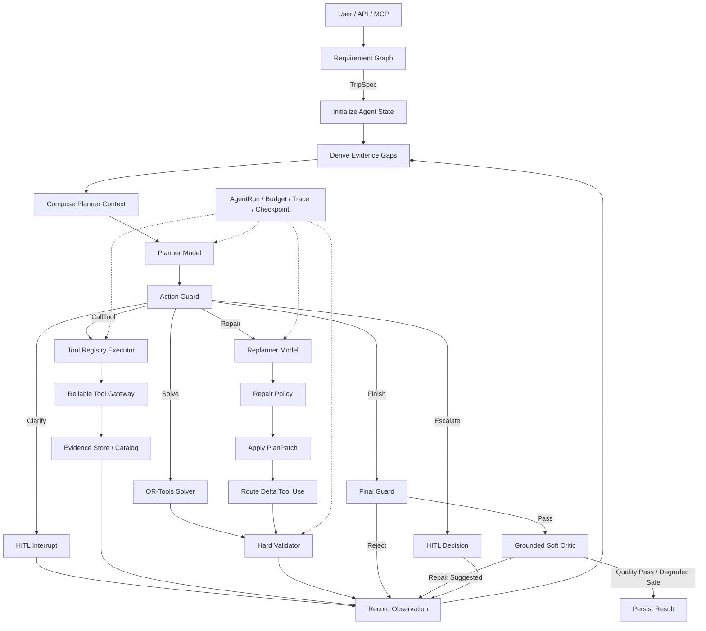

# v1.3 模型驱动 Agent 决策重构设计报告

> 状态：Draft，供后续开发与评审使用  
> 当前基线：v1.2.0  
> 目标版本：v1.3.0  
> 编写日期：2026-09-14  
> 核心主题：模型驱动决策、动态 Tool Use、受控 LLM Replanner

> 2026-09-22 实现进展：生产默认已切换为 `dynamic_planner`。Tool、Solve、Hard Validate、模型 Hard Repair、Grounded Soft Critic、Soft Repair、质量择优和 Lifecycle 创建均已迁移；动态 Graph 已接入进程内 Checkpoint。固定 Graph 仅保留为显式 Baseline、Shadow 主结果与历史消融对象。跨进程 Evidence/Checkpoint 持久化和真实模型动态轨迹评测仍属于后续工作。完整演进记录见 [LLM 状态转移迁移记录](llm-state-transition-migration.md)。

## 1. 执行摘要

当前项目已经具备 Requirement、Planning、Lifecycle/HITL 三条 LangGraph 工作流，并实现 Tool Gateway、OR-Tools 优化、Hard Validator、局部 Repair、Checkpoint、Preference Memory、AgentRun、ExecutionBudget 和 Trace。

现有系统的主要问题不是缺少组件，而是 **LLM 没有处在主规划循环的决策位置**：

- Planning Graph 的主要节点顺序由代码预先固定；
- `build_search_plan` 最终调用确定性 `create_search_plan()`；
- Planner/Replanner Specialist 主要为确定性函数提供强类型 Handoff 和上下文隔离；
- Tool 的调用时机和调用种类主要由 Graph 节点固定；
- Hard Repair 的动作主要由确定性 `build_repair_plan()` 生成；
- LLM 当前主要负责需求解析、编辑解析和 Soft Critic。

因此，当前系统更准确地属于“可靠的约束驱动工作流”，而不是“根据观察结果持续决定下一步行动的模型驱动 Agent”。

v1.3 不推翻现有可靠性底座，而是在其上新增一条动态 Agent 路径：

```text
Observe
  → Planner Decide
  → Action Guard
  → Clarify / Call Tool / Solve / Repair / Finish
  → Observation 回写 State
  → Hard Validate / Grounding Gate
  → 再次 Decide
```

核心职责边界保持不变：

- LLM 负责理解目标、识别 Evidence 缺口、选择能力、制定软规划策略和提出修复建议；
- Tool Registry 负责声明可调用能力与输入输出 Schema；
- Tool Gateway 负责可靠执行、缓存、重试、并发和 Provider Failover；
- OR-Tools 负责可确定计算的组合优化；
- Policy、Validator 和 Final Guard 负责硬约束、安全边界和最终交付；
- Orchestrator 负责状态、路由、预算、HITL 和终止，不允许模型直接修改持久化计划。

## 2. 目标与非目标

### 2.1 目标

v1.3 必须实现以下能力：

1. Planner 基于当前目标、Evidence、历史 Observation 和剩余预算，每轮输出一个强类型 Action。
2. 不同旅行需求能够产生不同的 Tool 调用路径，而不是始终执行同一条固定流水线。
3. Tool 结果以标准化 Observation 和 Evidence 写回 State，并影响下一轮模型决策。
4. Replanner 根据 Validator/Critic 结果生成结构化 PlanPatch，由确定性 Policy 审核后执行。
5. 模型无权绕过 Validator、修改用户硬约束、解锁内容或直接提交 PlanVersion。
6. 所有决策、Action、Observation、拒绝原因和终止条件进入安全 Trace。
7. 动态循环复用现有 ExecutionBudget、Checkpoint、Tool Gateway、Memory 和 Lifecycle 能力。
8. 保留当前固定工作流作为 Baseline 和降级路径，支持消融对比和灰度切换。

### 2.2 成功后的用户行为

对于下面的输入：

```text
国庆带父母去杭州三天，预算 3000 元，灵隐寺必须去，不想太累，
第一天 11:00 到杭州东站，第三天 19:00 离开。
```

目标轨迹不是固定执行所有工具，而应表现为：

1. Requirement Graph 抽取用户显式约束并完成确定性校验。
2. Planner 检查 Evidence Catalog，发现住宿区域和部分路线证据不足。
3. 对无法通过工具获取、且会显著影响计划的住宿区域创建 Clarify Action。
4. 用户回答后恢复同一 Thread，Planner 选择 POI Search。
5. Tool 执行结果标准化为 Evidence，Planner 判断路线矩阵仍缺失并选择 Route Matrix Tool。
6. Evidence 充分后，Planner 选择 Solve Action 并给出规划策略。
7. OR-Tools 生成候选，Validator 检测硬约束。
8. 若预算或步行约束失败，Planner 选择 Repair，Replanner 生成结构化 Patch。
9. Repair Policy 拒绝删除必去项，只应用合法动作并增量查询变化路线。
10. 候选重新验证，通过 Grounded Critic 与 Final Guard 后交付。

### 2.3 非目标

v1.3 不包含：

- OTA 库存、机票酒店下单和支付；
- 允许模型执行任意 Python、SQL、Shell 或外部写操作；
- 让模型决定预算、时间窗、权限、幂等和硬约束是否满足；
- 为了“多 Agent”标签拆成多个微服务；
- Agent 之间进行无 Schema 的自由文本协商；
- 将 Provider 原始响应、完整 Prompt 或完整 Memory 写入 Graph State/Trace；
- 一次性移除 v1.2 固定工作流；
- 将真实 Provider 或真实 LLM 失败静默回退为 Mock；
- 在 v1.3 同时完成 PostgreSQL Checkpointer、Redis Provider Cache、OpenTelemetry Collector 等全部平台强化工作。

## 3. 当前实现差距

| 能力 | v1.2 当前实现 | v1.3 目标差异 |
|---|---|---|
| Planner | `create_search_plan()` 确定性生成查询 | LLM 根据 Evidence 缺口输出强类型 Action |
| Tool Use | Graph 到达固定节点后调用固定工具 | Planner 从受限 Tool Registry 选择能力和参数 |
| Observation | 工具结果直接进入对应领域字段 | 同时生成标准化 Observation/Evidence，供下一轮决策 |
| Replanner | `build_repair_plan()` 由规则生成动作 | LLM 提议 Patch，Policy/Validator 审核和执行 |
| Specialist | 强类型 Handoff 包装函数调用 | Planner/Replanner 具备独立 Prompt、Gateway、上下文和输出契约 |
| Graph 路由 | 多数路径由静态 Edge 串联 | Action 驱动 Conditional Routing，执行后回到 Decide |
| 终止 | 固定节点达到 END | Finish Action 仍需通过 Final Guard 才能结束 |
| Trace | 已覆盖 Node/Tool/LLM/Repair | 新增 Decision、Action、Observation、Evidence Gap 和 Action Rejection |
| 评测 | 主要验证固定轨迹和最终状态 | 增加 Tool 选择、Action 合法性、无效调用和动态恢复轨迹 |

### 3.1 必须保留的现有资产

以下实现属于可靠性底座，不应在重构中重复开发：

- `requirements/workflow.py`：自然语言抽取、字段级澄清 Patch 和 Requirement Validator；
- `tools/gateway.py`：Timeout、Retry、Cache、并发控制和结构化失败；
- `tools/providers/chain.py`：Provider Failover 与 Circuit Breaker；
- `planning/optimization.py`：OR-Tools CP-SAT 求解与启发式降级；
- `planning/validator.py`：硬约束校验；
- `planning/impact.py`：Route Delta 与未受影响日期保护；
- `lifecycle/workflow.py`：候选选择、锁定、编辑、Preview、审批和天气事件；
- `memory/context.py`：确认偏好、作用域过滤、冲突检测与上下文裁剪；
- `execution/`：AgentRun、ExecutionBudget、Trace、Fault Injection 和 RunRepository；
- `evaluation/`：Benchmark、消融报告和轨迹完整性门禁。

## 4. 总体架构

### 4.1 目标架构图



### 4.2 三层决策边界

#### 模型决策层

- Planner：选择下一步语义动作；
- Critic：评价硬合法候选的体验质量；
- Replanner：基于违规和 Evidence 提议结构化 Patch；
- Requirement/Edit Model：解析自然语言，不直接写领域状态。

#### 确定性控制层

- Action Guard：检查 Action 是否在当前阶段允许；
- Evidence Policy：判定证据是否存在、是否过期、是否满足 Solve 前置条件；
- Repair Policy：检查 Patch 是否越权、影响范围是否超限；
- OR-Tools：进行组合优化；
- Hard Validator：校验预算、时间、路线、必去项等规则；
- Final Guard：决定是否允许交付或提交。

#### 执行基础设施层

- Tool Registry：能力声明、Schema 与权限；
- Tool Gateway：可靠执行与 Provider 抽象；
- Evidence Repository：保存标准化事实，State 只保留摘要和 ID；
- Checkpoint：暂停、恢复与故障恢复；
- AgentRun/Trace/Budget：运行治理与可观测性。

## 5. 强类型 Action 协议

### 5.1 设计原则

Planner 每轮只能返回一个 Action。Action 是可校验命令，不是自由文本计划，也不是 Chain-of-Thought。

每个 Action 必须满足：

- 使用 Pydantic 判别联合类型；
- `extra="forbid"`；
- 参数数量和字符串长度有界；
- 携带稳定 `action_id` 和 `action_fingerprint`；
- 携带简短 `decision_summary` 和结构化 `reason_code`；
- 引用 Evidence 时只能使用 Context 中已提供的 Evidence ID；
- 不允许包含 Provider、数据库连接、user_id 或 tenant_id；
- 不允许模型生成任意 Tool URL 或类名。

### 5.2 Action 类型

建议新增 `src/travel_agent/agents/actions.py`：

```python
from __future__ import annotations

from typing import Annotated, Literal, Union
from uuid import uuid4

from pydantic import BaseModel, ConfigDict, Field


class ActionBase(BaseModel):
    model_config = ConfigDict(frozen=True, extra="forbid")

    action_id: str = Field(default_factory=lambda: str(uuid4()))
    reason_code: str = Field(min_length=1, max_length=64)
    decision_summary: str = Field(min_length=1, max_length=512)
    evidence_ids: tuple[str, ...] = ()


class ClarifyAction(ActionBase):
    kind: Literal["clarify"] = "clarify"
    fields: tuple[str, ...] = Field(min_length=1, max_length=3)
    question: str = Field(min_length=1, max_length=512)


class CallToolAction(ActionBase):
    kind: Literal["call_tool"] = "call_tool"
    tool_name: str = Field(min_length=1, max_length=80)
    arguments: dict[str, object]
    evidence_goal: str = Field(min_length=1, max_length=256)


class SolveAction(ActionBase):
    kind: Literal["solve"] = "solve"
    strategy: Literal["relaxed", "balanced", "exploration", "auto"] = "auto"


class RepairAction(ActionBase):
    kind: Literal["repair"] = "repair"
    target_candidate_id: str
    target_violation_fingerprints: tuple[str, ...] = Field(min_length=1)


class FinishAction(ActionBase):
    kind: Literal["finish"] = "finish"
    candidate_id: str


class EscalateAction(ActionBase):
    kind: Literal["escalate"] = "escalate"
    issue_code: str
    question: str = Field(min_length=1, max_length=512)


AgentAction = Annotated[
    Union[
        ClarifyAction,
        CallToolAction,
        SolveAction,
        RepairAction,
        FinishAction,
        EscalateAction,
    ],
    Field(discriminator="kind"),
]
```

### 5.3 Planner 输出

```python
class PlannerDecision(BaseModel):
    model_config = ConfigDict(frozen=True, extra="forbid")

    schema_version: Literal["planner-decision-v1"] = "planner-decision-v1"
    action: AgentAction
    confidence: float = Field(ge=0, le=1)
    input_tokens: int | None = Field(default=None, ge=0)
    output_tokens: int | None = Field(default=None, ge=0)
```

`decision_summary` 只允许记录面向审计的短理由，例如“缺少住宿锚点，路线矩阵无法构建”，不得要求或存储模型隐式推理过程。

### 5.4 Action Guard

建议新增 `src/travel_agent/agents/action_policy.py`。Action Guard 必须执行：

1. 当前阶段是否允许该 Action；
2. 引用的 Evidence 是否存在且属于当前 Run/User；
3. Tool 是否在 Registry 中且允许 Planner 调用；
4. Tool 参数能否通过对应 Pydantic Schema；
5. Solve 前置 Evidence 是否齐全；
6. Repair 是否存在未解决违规；
7. Finish 候选是否已经 Hard Validated；
8. Action 是否与历史动作重复；
9. ExecutionBudget 是否允许该动作产生的新副作用；
10. 是否包含越权字段或未授权目标。

Guard 不通过时不得直接执行。系统应生成 `ActionRejectionObservation` 回写 State，允许 Planner 在预算内修正一次；连续拒绝达到上限后结束为明确失败或请求人工介入。

## 6. Observation 与 Evidence

### 6.1 为什么需要独立模型

当前 Tool 结果分散在 `poi_facts`、`route_results`、`tool_summaries` 等字段中。动态 Planner 需要一个统一、紧凑、可追溯的观察接口，但不应读取完整 Provider Payload。

v1.3 将两类对象分开：

- Observation：描述刚刚发生了什么，用于下一轮决策；
- Evidence：描述当前系统已掌握的外部事实，可被多个 Action 复用。

### 6.2 Evidence 模型

建议新增 `src/travel_agent/evidence/models.py`：

```python
class EvidenceKind(StrEnum):
    POI = "poi"
    ROUTE = "route"
    WEATHER = "weather"
    USER_CONSTRAINT = "user_constraint"
    PREFERENCE = "preference"
    VALIDATION = "validation"


class EvidenceRecord(BaseModel):
    model_config = ConfigDict(frozen=True, extra="forbid")

    evidence_id: str
    kind: EvidenceKind
    subject_key: str
    summary: str = Field(max_length=800)
    provider: str | None = None
    observed_at: datetime
    expires_at: datetime | None = None
    confidence: float = Field(ge=0, le=1)
    payload_ref: str | None = None
    content_hash: str
```

大型 POI 列表、路线矩阵和原始响应继续保存在领域对象或 State 外 Repository 中，Planner 只读取 `summary`、有效期、数量和 ID。

### 6.3 Evidence Gap

```python
class EvidenceGapStatus(StrEnum):
    OPEN = "open"
    SATISFIED = "satisfied"
    BLOCKED = "blocked"
    USER_REQUIRED = "user_required"


class EvidenceGap(BaseModel):
    key: str
    kind: EvidenceKind
    required: bool
    status: EvidenceGapStatus
    reason_code: str
    satisfied_by: tuple[str, ...] = ()
```

Evidence Gap 由确定性代码根据 TripSpec 和当前阶段派生，例如：

- `trip.anchor.arrival`；
- `trip.anchor.stay`；
- `poi.candidates.interests`；
- `route.matrix.required`；
- `weather.snapshot.required`；
- `candidate.hard_validation`。

Planner 可以决定用什么动作解决 Gap，但不能自行宣布 Gap 已满足。Gap 状态由 Evidence Policy 更新。

### 6.4 Observation 类型

```python
class ObservationKind(StrEnum):
    TOOL_RESULT = "tool_result"
    TOOL_FAILURE = "tool_failure"
    USER_INPUT = "user_input"
    ACTION_REJECTED = "action_rejected"
    SOLVE_RESULT = "solve_result"
    VALIDATION_RESULT = "validation_result"
    REPAIR_RESULT = "repair_result"


class AgentObservation(BaseModel):
    observation_id: str
    kind: ObservationKind
    action_id: str | None
    summary: str = Field(max_length=1_000)
    evidence_ids: tuple[str, ...] = ()
    error_code: str | None = None
    retryable: bool = False
    created_at: datetime
```

## 7. Tool Registry 与动态 Tool Use

### 7.1 两层 Tool 架构

v1.3 保留当前 Provider Gateway，并在上方新增 Agent Tool Registry：

```text
Planner Action
  → Tool Registry / Tool Policy
  → Domain Tool Executor
  → Existing Tool Gateway
  → Provider Chain
```

Planner 选择“领域能力”，不选择具体 Provider。高德、百度或 QWeather 的切换仍由 Gateway/Provider Chain 决定，避免模型将供应商选择与业务规划混在一起。

### 7.2 Tool Descriptor

建议新增 `src/travel_agent/tools/registry.py`：

```python
class ToolRisk(StrEnum):
    READ_ONLY = "read_only"
    USER_VISIBLE = "user_visible"


class ToolDescriptor(BaseModel):
    name: str
    description: str
    input_schema_name: str
    output_schema_name: str
    allowed_roles: frozenset[AgentRole]
    risk: ToolRisk
    max_batch_size: int
    cacheable: bool
    estimated_cost_units: int
```

Registry 对模型暴露的是经过裁剪的 Tool Manifest，而不是 Python Callable、Provider 配置或 Secret。

### 7.3 首批能力

首批只开放能够改变规划决策的粗粒度工具：

| Tool | 输入 | 输出 | 说明 |
|---|---|---|---|
| `poi.search` | 城市、关键词、数量 | 标准化 POI 摘要和 Evidence ID | 复用现有 POI Gateway |
| `anchor.resolve` | 到达/离开/住宿文本 | 标准化锚点 | 复用 Requirement 解析能力 |
| `route.build_matrix` | POI/Anchor ID、模式、策略 | Route Matrix 摘要 | Executor 内部批量调用，模型不逐边调用 |
| `route.load_delta` | 受影响日期/邻接变化 | 新增路线 Evidence | 复用 Route Delta |
| `weather.snapshot` | 目的地、日期范围 | 天气风险摘要 | 复用 Weather Gateway |
| `preference.retrieve` | 偏好类别、目的地 Scope | 确认偏好摘要 | user_id 从运行上下文注入，模型不可传入 |

不要在首版直接把所有 MCP 原子工具暴露给 Planner。过细的工具会增加 Tool 选择难度、调用次数和 Prompt 体积。

### 7.4 调用与失败语义

Tool Executor 必须：

1. 根据 `tool_name` 查找 Descriptor；
2. 校验 Role、阶段和风险等级；
3. 使用对应 Pydantic Model 校验参数；
4. 生成稳定 Idempotency Key；
5. 在产生副作用前消费 Tool Budget；
6. 调用现有 Tool Gateway；
7. 将成功结果标准化为 Evidence；
8. 将失败标准化为 ToolFailureObservation；
9. 不把 Provider 原始响应写入 Prompt、State 或 Trace。

失败处理分为两层：

- Gateway 层处理 Timeout、Retry、Cache、Circuit Breaker 和 Provider Failover；
- Agent 层读取最终 Observation，决定改变参数、选择其他能力、请求用户或终止。

业务不可行与 Tool 不可用仍必须分开。Tool 失败不能被模型改写成 `business_infeasible`。

## 8. Planner Model 与 Gateway

### 8.1 Planner Context

当前 `PlannerContext` 只有 TripSpec 和查询限制。v1.3 建议升级为：

```python
class PlannerContext(BaseModel):
    model_config = ConfigDict(frozen=True, extra="forbid")

    goal: TripSpec
    phase: AgentPhase
    evidence_gaps: tuple[EvidenceGap, ...]
    evidence_catalog: tuple[EvidenceSummary, ...]
    recent_observations: tuple[AgentObservation, ...]
    candidate_summaries: tuple[CandidateSummary, ...]
    violation_summaries: tuple[ViolationSummary, ...]
    tool_manifest: tuple[ToolDescriptor, ...]
    memory_summaries: tuple[PreferenceSummary, ...]
    budget_remaining: BudgetSnapshot
    context_manifest: ContextManifest
```

上下文必须遵守：

- 仅保留最近 N 条 Observation；
- Evidence 只传摘要和 ID；
- Candidate 只传目标分解、硬约束状态和必要日程摘要；
- 不传 Tool 原始响应；
- 不传完整历史对话；
- Memory 继续使用已确认、作用域匹配和预算裁剪规则；
- 明确记录 Context Manifest、Prompt Version 和输入字符/Token。

### 8.2 Planner Protocol

```python
@runtime_checkable
class PlannerModel(Protocol):
    name: str
    model: str
    prompt_version: str

    async def decide(self, context: PlannerContext) -> PlannerDecision:
        raise NotImplementedError
```

实现：

- `MockPlannerModel`：根据固定规则输出 Action，用于离线测试；
- `DeepSeekPlannerModel`：JSON Output + Pydantic 二次校验；
- `OpenAIPlannerModel`：Structured Outputs；
- `PlannerGateway`：复用 Requirement/Critic Gateway 的超时、有限重试、Token、Trace 和错误分类模式。

### 8.3 Prompt 要求

Planner Prompt 必须明确：

- 一次只选择一个 Action；
- 优先解决 required/open 的 Evidence Gap；
- 能用已有 Evidence 时不得重复调用 Tool；
- 只有工具无法获取且确实影响计划时才能 Clarify；
- Evidence 不足时禁止 Solve/Finish；
- 存在未解决硬违规时禁止 Finish；
- 不允许直接选择 Provider；
- 不允许生成计划持久化操作；
- `decision_summary` 是简短决策依据，不是完整推理过程。

### 8.4 无效输出处理

区分两种失败：

- Schema 无效：由 Planner Gateway 在调用预算内重试；
- Schema 有效但语义越权：由 Action Guard 拒绝并生成 Observation，返回 Planner 修正。

默认上限建议：

```text
PLANNER_MAX_DECISIONS=12
PLANNER_MAX_INVALID_ACTIONS=2
PLANNER_MAX_REPEATED_ACTIONS=2
PLANNER_TIMEOUT_SECONDS=20
PLANNER_MAX_ATTEMPTS=2
PLANNER_MAX_OUTPUT_TOKENS=1200
```

达到上限后根据状态终止：

- 已有硬合法候选：允许走确定性降级交付；
- 缺少用户输入：进入 HITL；
- 外部数据不可用：`external_tool_failure`；
- 模型持续无效：`llm_provider_failure` 或新增 `invalid_agent_decision`；
- 已证明硬约束冲突：`business_infeasible`。

## 9. Replanner Model 与安全执行

### 9.1 职责

Replanner 读取：

- 目标 Candidate 和 Draft；
- Validator 生成的违规摘要；
- Critic 的 Grounded 建议；
- 相关 POI/Route Evidence；
- 锁定日期和锁定项目；
- 已尝试动作指纹；
- 剩余修复预算。

Replanner 只输出结构化 Proposal，不直接修改 Candidate、State 或 Repository。

### 9.2 Proposal 模型

```python
class ModelRepairProposal(BaseModel):
    model_config = ConfigDict(frozen=True, extra="forbid")

    schema_version: Literal["model-repair-proposal-v1"]
    target_candidate_id: str
    source_violation_fingerprints: tuple[str, ...]
    actions: tuple[RepairAction, ...] = Field(min_length=1, max_length=3)
    affected_days: tuple[date, ...] = Field(max_length=2)
    evidence_ids: tuple[str, ...]
    expected_effect_codes: tuple[str, ...]
    summary: str = Field(max_length=512)
```

`RepairAction` 尽量复用当前领域模型，只新增模型确实需要的受限动作。首版允许：

- move；
- reorder；
- remove optional；
- replace optional；
- add optional；
- request alternative POI；
- request user decision。

### 9.3 Repair Policy

模型 Proposal 必须经过确定性 Policy：

- 禁止删除 `must_visit`；
- 禁止修改用户预算、日期、抵离时间和行动能力约束；
- 禁止修改 locked day/item；
- 禁止一次影响超过配置上限的日期；
- 禁止引用不存在的 Candidate/POI/Evidence；
- 禁止重复历史动作指纹；
- 必须声明目标违规和预期效果；
- 替换/新增 POI 必须经 Tool 获取标准化 Facts；
- 应用后必须计算 Route Delta 并重新 Hard Validate；
- 错误数不下降且违规指纹未变化时判定 no progress。

### 9.4 降级路径

现有确定性 `build_repair_plan()` 不删除，作为以下情况的降级路径：

- `REPLANNER_PROVIDER=disabled`；
- Replanner 超时或 Provider 不可用；
- Model Proposal 被拒绝且无剩余决策预算；
- 固定离线测试或消融实验。

降级必须记录 `degradation.applied`，不能静默伪装成模型修复成功。

## 10. Dynamic Planning Graph

### 10.1 新增 Graph，不直接重写旧 Graph

建议新增：

```text
src/travel_agent/graph/agentic_workflow.py
src/travel_agent/graph/agentic_state.py
```

保留当前 `graph/workflow.py` 作为 `fixed_workflow` Baseline。`runtime.py` 根据配置选择：

```text
AGENT_MODE=fixed_workflow
AGENT_MODE=dynamic_planner
AGENT_MODE=shadow_dynamic_planner
```

兼容已有 `single_graph/specialist_subagents/shadow_subagents` 时，可以先增加新 Enum，再在 v1.4 清理旧命名，避免一次修改破坏所有测试。

### 10.2 Agent State

新 State 不应复制全部 `TravelState`。建议通过组合 Slice 管理：

```python
class AgenticTravelState(TypedDict):
    execution: NotRequired[dict | None]
    thread_id: str
    trip: TripSpec

    phase: AgentPhase
    evidence_gap_keys: list[str]
    evidence_ids: list[str]
    recent_observations: list[AgentObservation]

    last_action: AgentAction | None
    action_history: list[ActionRecord]
    decision_round: int
    invalid_action_count: int

    planning_snapshot: PlanningSnapshot
    candidates: list[PlanCandidate]
    selected_plan: PlanCandidate | None
    validation_summary: ValidationSummary | None
    critic_summary: CriticExecutionSummary | None
    repair_history: list[RepairAttempt]

    pending_interrupt: dict | None
    terminal_reason: str | None
    status: str
```

大对象继续保存在 `PlanningSnapshot` 或 State 外 Repository 中。不要将旧 State 的每个临时字段直接复制到新顶层 State。

### 10.3 Graph 节点

| Node | 类型 | 主要职责 |
|---|---|---|
| `execution_budget_guard` | 确定性 | 检查 Deadline、Step、LLM、Tool 和 Action 预算 |
| `derive_evidence_gaps` | 确定性 | 根据 TripSpec、Evidence 和阶段计算未满足前置条件 |
| `compose_planner_context` | 确定性 | 投影最小上下文并生成 Context Manifest |
| `planner_decide` | LLM | 输出一个 PlannerDecision |
| `validate_action` | 确定性 | Schema 之外的阶段、权限、Evidence 和预算校验 |
| `dispatch_action` | Router | 根据 Action Kind 路由 |
| `request_clarification` | HITL | 创建 Interrupt，恢复后生成 UserInputObservation |
| `execute_tool_action` | Tool | 通过 Registry/Gateway 执行并生成 Evidence |
| `solve_plan` | 确定性 | 构建 OptimizationProblem、求解和物化 Candidate |
| `hard_validate` | 确定性 | 生成 ValidationObservation |
| `replanner_propose` | LLM | 生成 ModelRepairProposal |
| `validate_repair` | 确定性 | 动作白名单、锁、局部性、Evidence 和预算校验 |
| `apply_repair` | 确定性 | 应用 Patch、计算 Route Delta、重新物化 |
| `run_soft_critic` | LLM | 对硬合法 Candidate 做 Grounded Soft Critic |
| `final_guard` | 确定性 | 检查是否允许交付、降级或需要继续 Decide |
| `record_observation` | 确定性 | 裁剪 Observation History、更新 Evidence Gap |
| `mark_terminal` | 确定性 | 写入终止原因和最终状态 |

### 10.4 允许的阶段与 Action

| AgentPhase | 允许 Action |
|---|---|
| `researching` | Clarify、CallTool、Solve、Escalate |
| `solved` | CallTool、Repair、Finish、Escalate |
| `invalid` | CallTool、Repair、Escalate |
| `repairing` | CallTool、Repair、Escalate |
| `validated` | Finish、Repair、Escalate |
| `awaiting_user` | 仅 Resume 后由系统生成 Observation |
| `terminal` | 无 |

模型不能通过输出非法阶段转换改变 Graph 控制流。

### 10.5 Final Guard

即使 Planner 输出 Finish，仍必须满足：

1. Candidate 存在；
2. Candidate ID 与当前版本一致；
3. Hard Validation 为 deliverable；
4. 无未处理的 required Evidence Gap；
5. 无未处理锁冲突；
6. Route/POI Evidence 未过期到超出策略上限；
7. Soft Critic 已完成，或已记录明确的安全降级；
8. 当前请求未被取消；
9. Trace 保留终态事件额度；
10. 持久化写入满足幂等和版本条件。

Finish 被拒绝后产生 Observation，Planner 可以修正；模型无权自行标记验证通过。

## 11. HITL 与 Memory 集成

### 11.1 Clarify Action

Requirement Graph 继续处理初始字段缺失。Dynamic Planner 只在规划阶段处理以下澄清：

- 工具无法获得但会显著改变计划的用户选择；
- 多个 Grounding 候选无法唯一确认；
- 没有安全 Repair 时需要用户放宽或修改约束；
- 多个候选权衡接近，需要用户选择偏好。

Clarify Guard 必须检查：

- 问题是否可以通过已有 Tool/Evidence 解决；
- 是否重复询问同一字段；
- 是否超过 Interrupt Budget；
- 问题是否一次只聚焦最多三个字段；
- 恢复 Patch 是否只修改白名单字段。

### 11.2 Preference Tool

`preference.retrieve` 只能读取当前运行身份命名空间，模型不得传 `tenant_id/user_id`。Executor 使用运行上下文注入身份，并复用 `PreferenceContextComposer`：

- 仅确认、未撤销、未过期；
- Scope 匹配；
- 本次显式输入覆盖；
- 冲突偏好不进入 Planner Context；
- 按 Role、置信度、新鲜度和预算排序；
- Trace 只记录 Memory ID、类别、数量和排除原因。

Planner/Replanner 无权直接写 Memory。偏好写入仍通过 Proposal、用户确认和 Repository。

### 11.3 Lifecycle

现有 PlanLifecycleWorkflow 暂不并入 Dynamic Planning Graph。职责保持：

- Planning Agent 负责生成硬合法候选；
- Lifecycle Graph 负责选择、锁、编辑、Preview、审批、天气事件和版本提交；
- Lifecycle 需要重新生成候选时，通过 Application Service 创建新的 AgentRun 调用 Dynamic Planning Graph；
- 局部编辑可以逐步复用 LLM Replanner，但最终仍由 Lifecycle 的锁和 CAS 守卫提交。

这种边界避免一个超大 Graph 同时承担初始规划和长期会话生命周期。

## 12. 运行预算、幂等与终止

### 12.1 新预算项

建议在 `ExecutionBudget` 和配置中新增：

```text
max_agent_decisions: 12
max_invalid_actions: 2
max_repeated_action_count: 2
max_evidence_records: 256
max_observation_history: 8
max_planner_context_tokens: 6000
max_replanner_context_tokens: 5000
```

现有预算继续生效：Graph Step、Tool Call、Provider Attempt、LLM Call、Token、Repair Round、Interrupt、Checkpoint、Trace Event 和 Deadline。

### 12.2 Action Fingerprint

Fingerprint 至少包含：

```text
action kind
tool name / candidate id
canonical arguments
evidence goal
relevant evidence ids
current phase
```

同一 Fingerprint 连续出现超过上限时：

- 若 Evidence 未变化，标记 `agent_no_progress`；
- 若已有硬合法 Candidate，进入确定性 Final Guard；
- 若缺少用户输入，进入 HITL；
- 其他情况明确终止，禁止无限循环。

### 12.3 幂等

- Tool Action 使用 `run_id + action_fingerprint` 生成 Idempotency Key；
- Checkpoint 恢复时不得重复产生已经成功完成的 Tool 副作用；
- 当前工具均为只读，但仍需防止重复 Provider 计费和 Trace 重复；
- PlanVersion 提交继续使用 request_id、expected revision 和 CAS；
- Interrupt Resume 继续校验 interrupt_id 和 thread_id。

## 13. Trace 与安全观测

### 13.1 新增事件

建议扩展 `TraceEventType`：

```text
agent.decision_started
agent.decision_completed
agent.decision_failed
agent.action_validated
agent.action_rejected
agent.action_dispatched
agent.observation_recorded
evidence.gap_derived
evidence.recorded
evidence.expired
replanner.proposal_created
replanner.proposal_rejected
final_guard.completed
agent.no_progress
```

### 13.2 安全属性

允许记录：

- action kind、reason_code、fingerprint；
- tool name、参数 Schema 名、参数 Hash；
- Evidence ID、Kind、数量、是否过期；
- Candidate ID、Violation Fingerprint；
- Model、Prompt Version、Token、耗时；
- Guard 决策和拒绝原因；
- Budget 使用量和终止原因。

禁止记录：

- 用户原始完整 Prompt；
- 模型完整 Prompt/Response；
- Chain-of-Thought；
- Provider 原始响应；
- API Key、Approval Token；
- 完整住址、精确个人身份信息；
- Preference Memory 正文。

### 13.3 Trace 完整性

新增轨迹断言：

- 每个 `decision_started` 有 completed/failed；
- 每个完成 Decision 恰好关联一个 Action；
- 每个 dispatched Action 有 Observation 或 Interrupt/Terminal；
- CallTool Action 的 Tool Name 必须存在于对应 Context Manifest；
- Finish 必须有 Final Guard Pass；
- Repair 必须关联 Validator/Critic Evidence；
- 被拒绝 Action 不得产生 Tool/Repository 副作用；
- Sequence 连续，Run 只有一个 Start 和一个 Terminal。

## 14. API 与配置兼容性

### 14.1 API

现有对外 API 尽量保持兼容：

```text
POST /api/v1/plans
POST /api/v1/plans/from-text
POST /api/v1/plans/from-text/{thread_id}/resume
POST /api/v1/plan-sessions
POST /api/v1/plan-sessions/{session_id}/resume
GET  /api/v1/runs/{run_id}
GET  /api/v1/runs/{run_id}/trace
GET  /api/v1/runs/{run_id}/events
```

Planning Response 可向后兼容地增加：

```text
agent_mode
decision_count
action_summary
evidence_summary
degraded_reasons
```

不要默认返回完整 Action History 或 Evidence 正文。详细信息通过受权限控制的 Run/Trace API 查询。

### 14.2 配置

建议新增：

```text
AGENT_MODE=fixed_workflow|dynamic_planner|shadow_dynamic_planner

PLANNER_PROVIDER=mock|deepseek|openai
PLANNER_MODEL=<explicit-model-name>
PLANNER_TIMEOUT_SECONDS=20
PLANNER_MAX_ATTEMPTS=2
PLANNER_MAX_OUTPUT_TOKENS=1200
PLANNER_MAX_DECISIONS=12
PLANNER_MAX_INVALID_ACTIONS=2

REPLANNER_PROVIDER=deterministic|mock|deepseek|openai
REPLANNER_MODEL=<explicit-model-name>
REPLANNER_TIMEOUT_SECONDS=20
REPLANNER_MAX_ATTEMPTS=2
REPLANNER_MAX_OUTPUT_TOKENS=1600
```

真实 Provider 配置失败时不得自动回退 Mock。`shadow_dynamic_planner` 只运行影子决策，不执行 Tool 或写入计划，用于比较固定流程与模型动作。

## 15. 文件级改造方案

### 15.1 新增文件

| 文件 | 职责 |
|---|---|
| `src/travel_agent/agents/actions.py` | AgentAction、PlannerDecision、ActionRecord |
| `src/travel_agent/agents/action_policy.py` | Action Guard、阶段转换和拒绝原因 |
| `src/travel_agent/agents/planner/protocols.py` | PlannerModel Protocol |
| `src/travel_agent/agents/planner/gateway.py` | 超时、重试、预算、Trace 和错误映射 |
| `src/travel_agent/agents/planner/prompts.py` | Planner Prompt 与版本 |
| `src/travel_agent/agents/planner/providers/mock.py` | 确定性 Mock Planner |
| `src/travel_agent/agents/planner/providers/deepseek.py` | DeepSeek JSON Output Adapter |
| `src/travel_agent/agents/planner/providers/openai.py` | OpenAI Structured Output Adapter |
| `src/travel_agent/agents/replanner/protocols.py` | ReplannerModel Protocol |
| `src/travel_agent/agents/replanner/gateway.py` | Replanner 调用治理 |
| `src/travel_agent/agents/replanner/providers/` | Mock/DeepSeek/OpenAI Provider |
| `src/travel_agent/evidence/models.py` | EvidenceRecord、EvidenceGap、Observation |
| `src/travel_agent/evidence/policy.py` | Gap 派生、满足和过期策略 |
| `src/travel_agent/evidence/repository.py` | Evidence 存储 Protocol 与 Memory 实现 |
| `src/travel_agent/tools/registry.py` | ToolDescriptor、Registry、Manifest |
| `src/travel_agent/tools/agent_executor.py` | 动态 Action 到现有 Gateway 的适配器 |
| `src/travel_agent/graph/agentic_state.py` | Dynamic Agent State |
| `src/travel_agent/graph/agentic_workflow.py` | 新的动态 Planning Agent Graph |
| `src/travel_agent/evaluation/agentic_runner.py` | Action/Tool/Trajectory 评测 |
| `evals/v1_3/cases.jsonl` | v1.3 固定轨迹数据集 |
| `scripts/evaluate_v1_3_agentic.py` | v1.3 发布与消融入口 |

### 15.2 修改文件

| 文件 | 修改内容 |
|---|---|
| `src/travel_agent/config.py` | AgentMode、Planner/Replanner 配置和新预算项 |
| `src/travel_agent/runtime.py` | 构建 Planner/Replanner Gateway、Registry、Evidence Repository，并按模式选择 Graph |
| `src/travel_agent/agents/context.py` | 扩展 PlannerContext/ReplannerContext，保留旧模型兼容层 |
| `src/travel_agent/agents/contracts.py` | Handoff 增加 Decision/Proposal 输出类型和预算字段 |
| `src/travel_agent/execution/models.py` | 新 Trace Event、Terminal Reason 和 Decision Usage |
| `src/travel_agent/execution/context.py` | Decision/Action/Evidence 的预算和 Trace Helper |
| `src/travel_agent/domain/models.py` | 必要的 Candidate/Validation 摘要，不放 Agent 临时字段 |
| `src/travel_agent/graph/workflow.py` | 仅提取可复用确定性 Node/Service，不直接重写成动态循环 |
| `src/travel_agent/requirements/workflow.py` | Planning 调用按 AgentMode 选择新 Graph |
| `src/travel_agent/lifecycle/workflow.py` | 需要新建计划时调用 Dynamic Agent；局部编辑保持现有提交边界 |
| `.env.example` | 新增 Planner/Replanner/AgentMode 配置 |
| `README.md` | 完成 Gate 后更新实际能力、边界和评测结果 |

### 15.3 建议先提取的复用服务

当前 `graph/workflow.py` 较大。实现 Dynamic Graph 前，建议先将以下节点内部逻辑提取为无 Graph 依赖的 Service：

```text
planning/search_service.py
planning/route_matrix_service.py
planning/solve_service.py
planning/validation_service.py
planning/repair_service.py
planning/selection_service.py
```

旧 Graph 和新 Graph 同时调用这些 Service，避免复制业务逻辑，也避免在重构期改变现有行为。

## 16. 分阶段实施计划

### 阶段 0：冻结基线

任务：

1. 保存当前全量测试、120 次发布 Gate、180 次消融报告和 Git Commit；
2. 将当前模式命名为 `fixed_workflow`；
3. 增加 `dynamic_planner` Feature Flag，但暂不启用；
4. 补充当前固定 Graph 的关键轨迹 Golden Test。

完成条件：

- 现有 563 项通过测试不回退；
- 当前 Mock 发布和消融 Gate 仍可复现；
- API 响应无变化。

### 阶段 1：Action、Evidence 与 Policy

任务：

1. 实现 AgentAction 判别联合类型；
2. 实现 Action Fingerprint；
3. 实现 AgentPhase 与允许转换矩阵；
4. 实现 EvidenceRecord、EvidenceGap、Observation；
5. 实现 Action Guard 和 Evidence Policy；
6. 为非法阶段、未知 Evidence、重复动作和越权工具编写单元测试。

完成条件：

- 任意模型输出在执行前都能被确定性校验；
- 被拒绝 Action 不产生 Tool/Repository 调用；
- Pydantic 序列化可进入 LangGraph Checkpoint。

### 阶段 2：Tool Registry

任务：

1. 建立 ToolDescriptor 和 Registry；
2. 将 POI、Anchor、Route Matrix、Route Delta、Weather、Preference 接入；
3. 复用现有 Tool Gateway 和 Provider Chain；
4. 将结果转换为 Evidence/Observation；
5. 验证身份字段无法由模型提供；
6. 验证大批路线调用在 Executor 内部批量执行。

完成条件：

- Planner 只通过 Registry 调用工具；
- 工具参数、角色和阶段均受 Policy 约束；
- Provider 原始响应不进入 Agent Context；
- Tool 失败保持现有分类语义。

### 阶段 3：Planner Model

任务：

1. 实现 PlannerModel Protocol 与 Gateway；
2. 实现 Mock Planner；
3. 实现 DeepSeek/OpenAI Provider；
4. 构建 Context Projection 和 Context Manifest；
5. 增加 Schema Retry 与 Action Rejection Observation；
6. 记录模型、Prompt Version、Token、Action Kind 和 Reason Code。

完成条件：

- Mock Planner 可以在至少五类用例中产生不同 Action 轨迹；
- 真实 Planner 输出只能是已声明 Action；
- 不存在直接写 State/Repository 的模型调用；
- 连续无效 Action 能够有界终止。

### 阶段 4：Dynamic Planning Graph

任务：

1. 新建 AgenticTravelState；
2. 实现 Observe/Decide/Guard/Dispatch 循环；
3. 接入 Requirement TripSpec；
4. 接入 Tool Registry、OR-Tools 和 Validator；
5. 实现 Clarify Interrupt；
6. 实现 Final Guard；
7. 接入 AgentRun、ExecutionBudget 和 Checkpoint。

完成条件：

- 完整需求能动态完成 POI、路线、求解和交付；
- 缺信息需求进入 HITL，恢复后继续原 Run/Thread；
- 不同 Evidence 条件产生不同 Tool 路径；
- Finish 无法绕过 Hard Validator；
- 达到预算或重复动作上限后明确终止。

### 阶段 5：LLM Replanner

任务：

1. 实现 ReplannerModel、Gateway 和 Provider；
2. 实现 ModelRepairProposal；
3. 复用并扩展 Repair Policy；
4. 接入 Route Delta 和 Hard Revalidate；
5. 保留确定性 Repair 作为显式降级；
6. 覆盖非法删除 must_visit、修改 locked item、越界日期和重复动作。

完成条件：

- Replanner 只生成 Patch，不直接修改计划；
- 非法 Proposal 不能产生 Tool/Repository 副作用；
- 合法 Patch 必须重新验证后才可交付；
- 修复无进展、模型失败和业务无解具有不同终止原因。

### 阶段 6：HITL、Memory 与 Lifecycle 集成

任务：

1. 合并规划期 Clarify 与现有 Interrupt 语义；
2. 接入 Preference Tool 和确认偏好 Context；
3. 让 Lifecycle 在重建计划时调用 Dynamic Agent；
4. 验证候选选择、锁定、Preview、审批和版本 CAS；
5. 验证 Checkpoint/SQLite 重启恢复；
6. 验证当前输入覆盖历史偏好。

完成条件：

- 动态 Agent 不破坏现有 Lifecycle 状态机；
- 锁定和审批边界不可由模型绕过；
- Memory 跨用户隔离；
- 恢复执行不会重复 Tool 或版本提交。

### 阶段 7：Trace、评测与发布门禁

任务：

1. 增加 Decision/Action/Observation/Evidence Trace；
2. 扩展 Trace 完整性断言；
3. 建立 30～50 条动态轨迹用例；
4. 增加 fixed vs dynamic、deterministic vs LLM Replanner 消融；
5. 增加 Action Schema、Prompt Injection、Tool Failure 和重复循环故障注入；
6. 使用小规模真实模型 Profile 验证 Action 合法率和轨迹质量；
7. Gate 通过后才修改 README 和简历指标。

完成条件：

- Mock Gate 全部通过；
- 硬合法交付率为 100%，不安全交付为 0；
- 有界终止率、失败分类准确率和 Trace 完整率为 100%；
- 真实模型 Profile 无越权 Tool/Repair/Finish；
- 报告包含模型、Prompt、数据集、Git 和配置指纹。

## 17. 测试与评测设计

### 17.1 单元测试

必须覆盖：

- Action 判别联合类型和 JSON Schema；
- Action Fingerprint 稳定性；
- AgentPhase 转换矩阵；
- Action Guard 拒绝原因；
- Tool Descriptor、参数 Schema 和 Role 权限；
- Evidence Gap 派生、满足、过期与冲突；
- Context Projection 与预算裁剪；
- Repair Policy；
- Final Guard；
- 新预算项和 Terminal Reserve。

### 17.2 轨迹测试

建议至少覆盖：

| 场景 | 预期关键轨迹 |
|---|---|
| 完整需求、无缓存 | POI → Route Matrix → Solve → Validate → Finish |
| 已有有效 POI Evidence | 跳过 POI，直接补 Route/Solve |
| 已有完整 Evidence | 不调用 Tool，直接 Solve |
| 缺用户住宿选择 | Clarify → Resume → Route/Solve |
| POI Tool 超时后成功 | ToolFailure/Retry → Observation → Continue |
| Provider Chain 耗尽 | ToolFailure → Planner Escalate/Terminate |
| 首次候选预算违规 | Validate → Repair → Delta Route → Revalidate |
| Replanner 删除 must_visit | Proposal Rejected → 新 Decision，无副作用 |
| Planner 提前 Finish | Final Guard Rejected → Observation → Continue |
| Planner 重复同一 Tool | Repeated Fingerprint → No Progress/Terminate |
| Critic 不可用 | Hard Valid → Degraded Safe Finish |
| 用户取消 | Cancel → Terminal，不再调用 Tool/LLM |

轨迹断言优先使用 subset/required-event 语义，不要对模型可能存在的多条合理路径全部使用 exact sequence。

### 17.3 精简评测矩阵

为控制真实模型成本，发布评测分两层：

#### 必跑离线 Gate

- 30～50 条固定 Case；
- Mock Planner、Mock Replanner、Mock Tool Provider；
- 可在 CI 中运行；
- 验证状态机、安全、终止、Trace 和故障语义。

#### 手动真实模型 Gate

- 选取 20～30 条代表性 Case；
- 只运行一个主模型配置；
- 对关键 Case 重复 2～3 次；
- 统计 Action Schema Validity、Tool Selection、Completion、Hard Constraint、Token、成本和延迟；
- 修改 Prompt、Model 或 Tool Manifest 后手动重跑。

不要求每个功能点都有独立指标。简历只保留两类最有解释力的数据：

1. Full Agent 与 No Validator/Direct LLM 的安全与可执行性差异；
2. Dynamic Tool Use 与 Cache/Fixed Workflow 的调用效率差异。

### 17.4 消融配置

```text
full_dynamic
fixed_workflow
dynamic_no_validator
dynamic_deterministic_replanner
dynamic_no_soft_critic
dynamic_cache_off
shadow_dynamic
```

所有消融使用独立 Runtime、独立 Cache 和相同 Dataset，避免跨 Variant 污染。

## 18. 失败语义

| 场景 | 终止/处理 | 禁止行为 |
|---|---|---|
| Planner Schema 连续无效 | `llm_provider_failure` | 回退 Mock |
| Action 语义越权 | 拒绝并生成 Observation；超限后失败 | 执行 Tool/Patch |
| Tool Provider 失败 | `external_tool_failure` 或 Planner 改变策略 | 标记业务不可行 |
| Evidence 不足且 Tool 可用 | 继续 CallTool | 提前 Solve/Finish |
| Evidence 不足且需用户输入 | HITL Clarify | 模型猜测硬字段 |
| OR-Tools 无解 | Validator/冲突证明后 `business_infeasible` | 伪造可行计划 |
| Replanner Proposal 非法 | Repair Rejected，允许重新决策 | 修改 locked/must_visit |
| Repair 无进展 | `agent_no_progress` | 无限 Replan |
| Critic 不可用 | 硬合法计划降级交付 | 标记业务不可行 |
| Checkpoint/Repository 失败 | 对应基础设施失败 | 重复提交版本 |
| Budget/Deadline 耗尽 | 明确终止 | 继续外部调用 |

建议新增 Terminal Reason：

```text
invalid_agent_decision
agent_no_progress
evidence_unavailable
action_policy_rejected
```

如果不希望扩展外部枚举，可先将其作为 `degraded_reasons/error_code`，但内部必须能够区分。

## 19. 风险与缓解措施

| 风险 | 影响 | 缓解 |
|---|---|---|
| 动态 Planner 增加不确定性 | 同一输入轨迹不同 | 强类型 Action、低温度、预算、轨迹 subset 断言 |
| Tool Manifest 过大 | Token/成本上升 | 粗粒度能力、按 Phase/Role 裁剪 |
| Planner 重复调用工具 | 成本和延迟失控 | Evidence Gap、Action Fingerprint、Cache、No Progress |
| 模型提前 Finish | 不安全交付 | Final Guard 强制 Validator/Evidence Gate |
| Replanner 修改硬约束 | 破坏用户意图 | Patch 白名单、Lock Guard、Validator |
| 动态 Graph 与旧逻辑重复 | 维护成本增加 | 提取共享 Service，Feature Flag 迁移 |
| Checkpoint 恢复重复执行 | 重复 Provider 调用/版本提交 | Action Idempotency Key、Checkpoint 状态、CAS |
| Mock 轨迹过于理想 | 不能证明真实模型行为 | 小规模 Live Gate，报告明确证据等级 |
| Specialist 名称大于实际能力 | 简历与实现不一致 | 只有独立模型决策、Context 和 Contract 后才称 Specialist Agent |

## 20. Definition of Done

v1.3 只有同时满足以下条件才能标记完成：

### Agent 行为

- Planner 基于当前 State 输出强类型 Action；
- 至少五类输入产生不同 Tool/Action 轨迹；
- Tool Observation 能改变后续决策；
- LLM Replanner 能提出 Patch，但不能越过 Policy；
- Final Guard 能阻止提前 Finish；
- 所有循环有 Action、LLM、Tool、Repair 和 Deadline 上限。

### 安全与正确性

- 所有已交付计划通过 Hard Validator；
- 不安全交付为 0；
- 模型不能删除 must_visit、修改锁定内容或直接提交版本；
- Tool 失败、Evidence 不足、业务无解和模型失败分类清晰；
- Provider 原始响应、Prompt、Secret 和 Memory 正文不进入 Trace。

### 可恢复性

- Clarify 可以 Interrupt/Resume；
- Checkpoint 恢复不会重复已完成 Action；
- Lifecycle 的候选选择、编辑和审批仍可用；
- request_id、revision 和 CAS 行为不回退。

### 可观测性与评测

- Decision、Action、Observation、Evidence、Tool、Validator、Repair 和 Terminal 可由 Trace 串联；
- Trace 完整率和有界终止率达到发布 Gate；
- 固定工作流继续作为 Baseline 可运行；
- Mock Gate、真实模型小规模 Gate 和消融报告均包含可复现信息；
- README 与简历只引用重新执行后的实际数据。

## 21. 推荐的开发顺序与提交边界

建议严格按以下顺序推进：

```text
1. 冻结 Baseline 与 Feature Flag
2. Action / Evidence / Policy
3. Tool Registry
4. Planner Protocol / Gateway / Mock
5. Dynamic Graph
6. 真实 Planner Provider
7. Replanner Protocol / Policy / Mock
8. 真实 Replanner Provider
9. HITL / Memory / Lifecycle 集成
10. Trace / Eval / Release Gate
```

不要先写 Planner Prompt，再补 State 和 Guard。正确顺序是先冻结模型可做和不可做的类型边界，再接入真实模型。

建议每个阶段独立提交，且每次提交满足：

- 新增行为有对应测试；
- 旧测试不回退；
- 新增关键方法有结构化日志/Trace；
- 不在同一提交中混入无关前端、基础设施或格式化改动。

## 22. 完成后可支撑的简历主张

完成本设计并重新评测后，项目可以真实支撑以下表述：

> 基于 LangGraph 构建模型驱动的旅行规划 Agent，由 Planner 根据目标、Evidence 和执行预算动态选择澄清、Tool Use、约束求解、Repair 或终止；Critic 与 Replanner 通过强类型 Handoff 完成质量评审和局部修复，确定性 Policy、OR-Tools 与 Validator 负责动作执行及安全交付，形成可追踪、可恢复的 `Observe → Decide → Act → Validate → Replan` 闭环。

这项主张成立的前提不是“新增了 Planner 类”，而是 Trace 和评测能够证明：

- 模型确实输出了下一步 Action；
- 不同 Evidence 导致不同工具路径；
- Tool Observation 改变了后续决策；
- Replanner Proposal 被 Policy 接受或拒绝；
- Finish 无法绕过 Validator；
- 整个循环在共享预算内终止。
