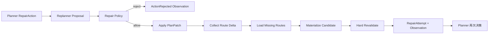

# v1.3 LLM 状态转移迁移记录

> 更新日期：2026-09-21  
> 目标：记录 TravelPilot 从“确定性 Planning Graph 控制主流程”演进到“LLM Action 控制状态转移”的实现过程，方便源码学习、架构复盘和面试讲解。

## 1. 这次迁移解决了什么问题

迁移前虽然已经有 `dynamic_planner`，但它只控制外层动作：

```text
Planner -> CallTool -> Planner -> Solve
                              |
                              v
                    run_planning(fixed_workflow)
                              |
                              v
               固定 Graph 在内部完成全部步骤和修复
```

这意味着模型看似选择了 `SolveAction`，实际控制权又立即交回原来的确定性 LangGraph。外层 Planner 无法观察候选为何失败，也无法通过下一次 `RepairAction` 真正推进计划状态。

迁移后的动态路径是：

```text
Observe
  -> PlannerDecision
  -> Action Guard
  -> CallTool / Solve / Repair / Finish
  -> Observation + Evidence + Kernel Snapshot
  -> PlannerDecision
```

`SolveAction` 和 `RepairAction` 现在都直接改变 `AgenticTravelState`。旧 `fixed_workflow` 不再是动态路径的运行时依赖。

## 2. 迁移原则

“让 LLM 决定状态转移”不等于“让 LLM 决定事实和硬约束”。本次仍保留以下确定性边界：

- LLM 决定下一步选择哪个 Action；
- Action Guard 决定动作是否允许执行；
- Tool Gateway 决定如何可靠访问外部 Provider；
- OR-Tools 决定约束组合解；
- Repair Policy 决定模型 Patch 是否越权；
- Hard Validator 决定 Candidate 能否交付；
- Final Guard 决定是否允许结束 Run；
- ExecutionBudget 决定循环是否必须终止。

面试时可以把它概括为：

> 状态转移由模型提议，副作用和状态真实性由确定性代码裁决。

## 3. 第一步：抽出无 Graph 依赖的规划内核

新增 [planning/kernel.py](../../src/travel_agent/planning/kernel.py)。

### 3.1 原实现

`graph/workflow.py` 内部定义了大量嵌套 Node：

```text
resolve_poi_facts
-> resolve_stay_anchor
-> derive_day_boundaries
-> build_route_matrix
-> build_optimization_problem
-> solve_candidate_variants
-> materialize_candidates
-> validate_candidates
```

这些函数闭包依赖 Graph 构建参数，只能通过执行整张 Graph 复用。动态路径为了求解只能调用 `run_planning(fixed_workflow)`。

### 3.2 修改思路

把“领域计算”从“Graph 调度”中分离：

- Graph 只负责状态和动作路由；
- `PlanningKernelService` 负责确定性规划能力；
- 输入必须是 Planner 已经收集到的标准化 Evidence；
- 输出是 `PlanningKernelSnapshot`，而不是另一张 Graph 的最终 Response。

### 3.3 新的 Solve 链路

`PlanningKernelService.solve()` 按以下顺序执行：

1. 将 `POIFacts` 经 `POIDefaultPolicy` 规范化为 `PlanningPOI`；
2. 解析用户住宿或推荐住宿区域锚点；
3. 生成每天的抵达、住宿和离开边界；
4. 选择进入优化器的有限 POI 集；
5. 根据完整路线查询集合检查 Route Evidence；
6. 构造 `OptimizationProblem`；
7. 执行 OR-Tools CP-SAT；
8. 超时或无解时使用显式标记的启发式降级；
9. 按 `SolveAction.strategy` 过滤候选风格；
10. 物化具体时间线；
11. 对每个 Candidate 执行 Hard Validator；
12. 返回候选、Draft、路线、住宿锚点和修复历史组成的 Snapshot。

### 3.4 为什么 Snapshot 很重要

动态 Repair 需要的不只是最终 `PlanCandidate`，还需要：

- 对应的 `CandidateDraft`；
- 规范化 `PlanningPOI`；
- 当前 Route Matrix；
- Stay Resolution 和 Day Boundaries；
- 迭代次数与 Repair History。

如果 Solve 只返回最终文本或 PlanningResponse，下一轮模型虽然能说“修一下”，系统却没有足够的结构化状态安全应用 Patch。

## 4. 第二步：让路线 Tool 产生可直接求解的 Evidence

修改 [tools/agent_executor.py](../../src/travel_agent/tools/agent_executor.py)。

### 4.1 原实现的问题

原 `route.build_matrix` 把抵达点、离开点、住宿点和 POI 做简单两两组合，并截断为最多 8 条路线：

```text
queries[:8]
```

这只能证明 Tool 调用发生过，不能保证后续物化所需路线全部存在。旧实现之所以仍能完成，是因为固定 Graph 又重新构建并加载了一次完整矩阵。

### 4.2 新实现

路线 Executor 现在复用与求解器一致的领域策略：

```text
POIFacts
-> POIDefaultPolicy
-> select_optimization_pois
-> resolve_stay_anchor
-> derive_day_boundaries
-> collect_route_matrix_queries
-> ToolGateway.get_routes
```

只有全部路线成功时才创建 Route Evidence；任何一条技术失败都会返回 `ToolFailureObservation`，不会用部分矩阵谎称 Gap 已满足。

批量上限仍由 Tool Registry 的 `max_batch_size` 控制，模型不能无限扩大调用。

### 4.3 为什么 Provider 策略不交给模型

Action 中的路线模式和策略先通过 Schema，但服务端最终使用 `PlanningPolicy` 约束路线矩阵。原因是 Solve 和 Tool 必须使用一致的 Route Key；如果模型让 Tool 用策略 A，而求解内核用策略 B，会产生“已有 Route Evidence，但实际键缺失”的隐性错误。

模型可以选择“是否需要路线能力”，Provider、URL、Secret 和安全策略仍由系统控制。

## 5. 第三步：SolveAction 真正推进动态 State

修改 [graph/agentic_workflow.py](../../src/travel_agent/graph/agentic_workflow.py)。

### 5.1 删除的耦合

动态 Graph 的构造参数从：

```python
build_agentic_workflow(fixed_workflow=...)
```

变为：

```python
build_agentic_workflow(planning_kernel=...)
```

`solve_plan()` 中不再出现 `run_planning()`。

### 5.2 Solve 后写回哪些状态

- `kernel_snapshot`：下一轮 Repair 所需完整领域快照；
- `candidates`：Planner 可见的候选摘要来源；
- `selected_plan`：存在硬合法候选时的当前最佳计划；
- `route_results`：当前可复用路线矩阵；
- `iterations`：修复轮次；
- `phase`：有合法候选进入 `VALIDATED`，否则进入 `INVALID`；
- Validation Evidence：每个候选一条，可被 Finish 引用；
- Solve Observation：告诉 Planner 候选数量和硬合法状态。

### 5.3 Evidence 完整性失败如何处理

Solve 会重新计算必需路线键。如果 Route Evidence 只在形式上存在、实际 Payload 不完整，则抛出 `PlanningEvidenceMissingError`，Run 以 `evidence_unavailable` 安全终止。

这里没有选择在 Solve 内偷偷补查路线，因为那会让 Trace 显示 Planner 只调用了一次工具，实际却发生隐藏 Tool Use。

## 6. 第四步：模型 Patch 的真实应用链路

迁移前 Replanner 只执行：

```text
Proposal -> Repair Policy -> 记录结果 -> 终止
```

迁移后执行：



### 6.1 Policy 在副作用之前检查什么

- Candidate 是否存在；
- Violation Fingerprint 是否来自当前 Context；
- Evidence 引用是否合法；
- Proposal 是否重复；
- 影响日期是否越界或超过上限；
- POI 是否存在；
- 是否修改锁定项；
- 是否删除必去项。

### 6.2 Patch 应用后的不变量

- 未受影响日期通过 `day_fingerprint` 验证必须保持不变；
- 只加载缺失 Route Delta；
- 修复后的 Candidate 必须重新物化，不能直接改最终时间文本；
- 必须重新执行 Hard Validator；
- 比较修复前后 Error Count 和 Violation Fingerprint；
- 重复违规或无改进会产生明确终止原因；
- 只有复验通过的 Candidate 才能进入 `VALIDATED` 和 `FinishAction`。

### 6.3 确定性 Replanner 为什么仍保留

配置仍支持 `REPLANNER_PROVIDER=deterministic`，用于无远程模型环境和回归基线。区别是它现在也会被转换为同一个 `ModelRepairProposal` 契约，并经过相同 Policy、Patch Apply、Route Delta 和 Hard Revalidate。

因此确定性 Replanner 是可替换 Proposal Provider，不再是隐藏在固定 Graph 中的状态控制器。

## 7. 第五步：预算与 Trace 同步迁移

新增动态 `apply_repair` Node 后，同时更新了 Execution Instrumentation：

- `apply_repair` 消耗共享 Repair Budget；
- Solve 后记录 `validation.completed`；
- Repair 后记录 `repair.applied` 和重新校验结果；
- Observation 记录 Patch 模式、Outcome 和错误原因；
- Planner 下一轮可以从 Candidate/Violation Summary 看到新状态。

这一步很重要：如果只改业务代码，不把新 Node 纳入预算和 Trace，Agent 会出现“功能能跑，但治理看不到”的架构漂移。

## 8. 运行时组装怎样变化

[runtime.py](../../src/travel_agent/runtime.py) 现在分别构建：

- `fixed_workflow`：继续用于固定 Baseline 和 Shadow 对照；
- `PlanningKernelService`：供 Dynamic Agent 使用；
- `AgentToolExecutor`：与 Kernel 共享 Defaults、PlanningPolicy 和 OptimizationBudget；
- `agentic_workflow`：注入 Kernel，而不是注入固定 Graph。

因此两种模式复用同一批领域函数和 Gateway，但控制面已经分离：

```text
fixed_workflow: 静态 Edge 决定下一节点
dynamic_planner: Planner Action 决定下一节点
```

## 9. 测试如何证明迁移有效

[tests/test_v1_3_agent_foundation.py](../../tests/test_v1_3_agent_foundation.py) 新增或强化三类测试。

### 9.1 动态 Happy Path

断言轨迹为：

```text
call_tool -> call_tool -> solve -> finish
```

同时验证每个 Candidate 都生成 Validation Evidence。

### 9.2 Kernel Patch 单元链路

构造一个带硬违规的 Candidate，应用模型 Proposal，断言：

- Patch 产生新 Candidate ID；
- Repair Round 增加；
- Route Delta 统计存在；
- 修复后重新校验通过；
- 只有通过候选才被选中。

### 9.3 动态 Repair 轨迹

使用真实 Kernel 和 Mock Planner/Replanner 强制首轮候选失败，断言轨迹为：

```text
call_tool
-> call_tool
-> solve
-> repair
-> finish
```

最终 Candidate ID 带 `repair-r1`，`iterations == 1`，并且 Hard Validator 通过。这证明 Repair 不再是只记录 Proposal，而是真正改变 State 后回到 Planner。

## 10. 2026-09-22：完成剩余生产功能迁移

第二阶段继续拆除了动态路径对旧固定 Graph 的功能依赖：

1. 将 Critic Evidence、Grounding、Quality Gate、Soft Repair 和候选解释提取为无 Graph 依赖的 `QualityReviewService`；
2. 在 Dynamic Graph 中加入 `review_quality → quality_gate → apply_soft_repair → hard_validate → review_quality → compare_soft_repair` 可观察闭环；质量未达到最小提升时恢复 baseline；
3. 把 `anchor.resolve`、`weather.snapshot`、`preference.retrieve` 接入 `AgentToolExecutor`；`route.load_delta` 继续由 Kernel 根据 Patch 差异受控执行；
4. 给 Dynamic Graph 接入进程内 Checkpoint，使 Lifecycle 可以读取 `kernel_snapshot` 创建计划版本；
5. 将 Lifecycle 的首次规划改为统一 Planning Runner，不再直接调用固定工作流；
6. 把代码级默认切换为 `dynamic_planner`，并将旧 `specialist_subagents` / `shadow_subagents` 配置迁移为动态/影子动态别名；Runtime 不再实例化旧 `SpecialistExecutor`；
7. 将历史 Release/Ablation 测试显式锁定到 `fixed_workflow`，防止生产默认变化污染既有纵向指标。

完成后的生产轨迹可以准确表述为：

> Planner 根据 Evidence Gap 逐轮选择 Tool、Solve、Repair 或 Finish；确定性 Guard 约束动作，Planning Kernel 负责 OR-Tools 求解、Patch 应用、路线增量与硬校验，Quality Review Service 负责 Grounded Critic、受控软修复和质量比较。所有阶段都在动态 LangGraph 中可见，固定 Graph 不再是生产规划功能的内部执行器。

## 11. 当前保留项与后续工作

`fixed_workflow` 没有从仓库删除，但它现在只承担三类有意保留的职责：

- 历史 Baseline 与可复现回归；
- `shadow_dynamic_planner` 的稳定主结果；
- v1.0 Release/Ablation 指标的原实验对象。

这些属于对照基础设施，不是“尚未迁移的生产模块”。下一阶段工作是可靠性和证据建设：

1. 为动态 Evidence Repository 与 Checkpoint 增加 SQLite/PostgreSQL 跨进程恢复；
2. 建立 30～50 条动态轨迹集，对比 Fixed、Shadow、Dynamic 的质量、成本和恢复率；
3. 使用真实模型 Profile 验证 Action 合法率、Grounding、软修复收益和 Provider 故障恢复；
4. 在真实发布 Gate 通过后，再决定是否删除旧固定 Graph 和旧模式枚举。
